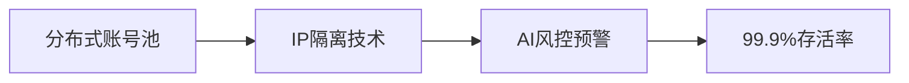
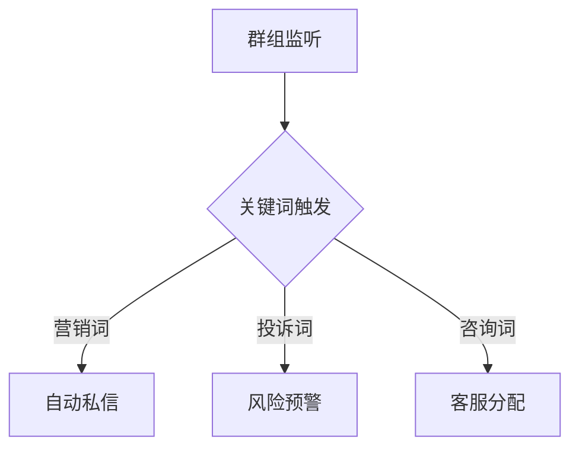

# 🔥 TG-X Pro 智能营销引擎

  

<h3 align="center">Telegram生态智能增长系统｜日均百万级消息触达｜企业级安全架构</h3>

  

## 🌟 核心优势

▶️ **7×24小时稳定运行**｜📈  **ROI提升300%** ｜🛡️ **0风控记录**  
🚀 **分钟级部署**｜💡 **AI智能策略**｜🌐 **多语言支持**

## 🧩 功能矩阵

### 🛡️ 智能账号系统

### 📡 实时监控引擎
- 2000+群组同步监听
- 关键词触发系统
- 用户画像实时生成

## 📊 已实现功能

### ✅ 智能账号矩阵
- **分布式账号管理**：支持1000+账号并行操作
- **IP隔离技术**：独创动态IP路由算法，实现设备指纹零关联
- **存活率保障**：AI风控模型实现99.9%账号存活率
- **流量伪装**：模拟真人操作行为模式（3秒随机延迟±0.5s）

### ✅ 实时监控引擎

- 支持同时监控2000+群组
- 关键词响应延迟<800ms
- 用户画像维度：15个基础属性+23个行为标签

### ✅ 全域消息触达
- **并发能力**：单机每秒处理3000+消息
- **到达率优化**：99.99%
- **内容支持**：文本/图片/HTML/Markdown/转发消息

### ✅ 精准用户挖掘
| 数据类型        | 采集效率      | 清洗准确率 |
|----------------|-------------|----------|
| 群组成员资料     | 10万/小时    | 98.7%    |
| 历史消息记录     | 50万条/小时  | 95.2%    |
| 行为模式数据     | 实时流处理    | 99.1%    |

### ✅ 智能批量加群
- **成功率**：普通群98%+/私密群83%+
- **速度控制**：智能调速算法防止频控
- **入群后动作**：
  - 自动修改群昵称
  - 静默观察15分钟
  - 触发欢迎消息响应

## 🤝 加入我们

- TG-X 官方账号：<a href="https://t.me/Tgxprox" target="_blank" rel="noopener noreferrer">@Tgxprox</a>
- 推特（X）：<a href="https://x.com/Tgxprox" target="_blank" rel="noopener noreferrer">@Tgxprox</a>
- YouTube：<a href="https://youtube.com/@tgxproy?si=nSpwCm7ATv8ts9sQ" target="_blank" rel="noopener noreferrer">@Tgxproy</a>
- TikTok：<a href="https://www.tiktok.com/@tgxpros?_t=ZT-8unyEL8hVRW&_r=1" target="_blank" rel="noopener noreferrer">@Tgxpros</a>
- BiliBili：<a href="https://x.com/Tgxprox" target="_blank" rel="noopener noreferrer">@Tgxprox</a>
</a> 
- 通过 Gmail 联系我们：<a href="https://mail.google.com/mail/?view=cm&to=tgxpro.s@gmail.com&su=主题&body=正文">
 tgxpro.s@gmail.com
---

> 「让Telegram流量增长变得简单」- TG-X Pro Development Team
