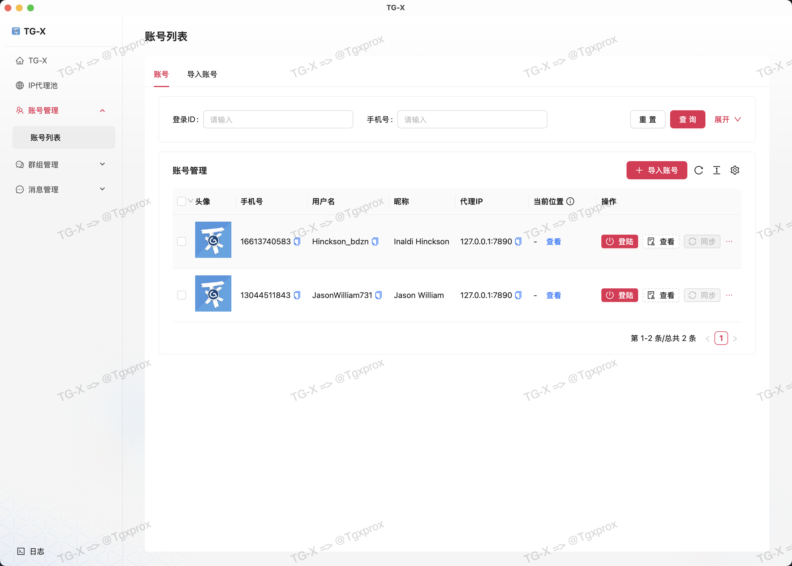
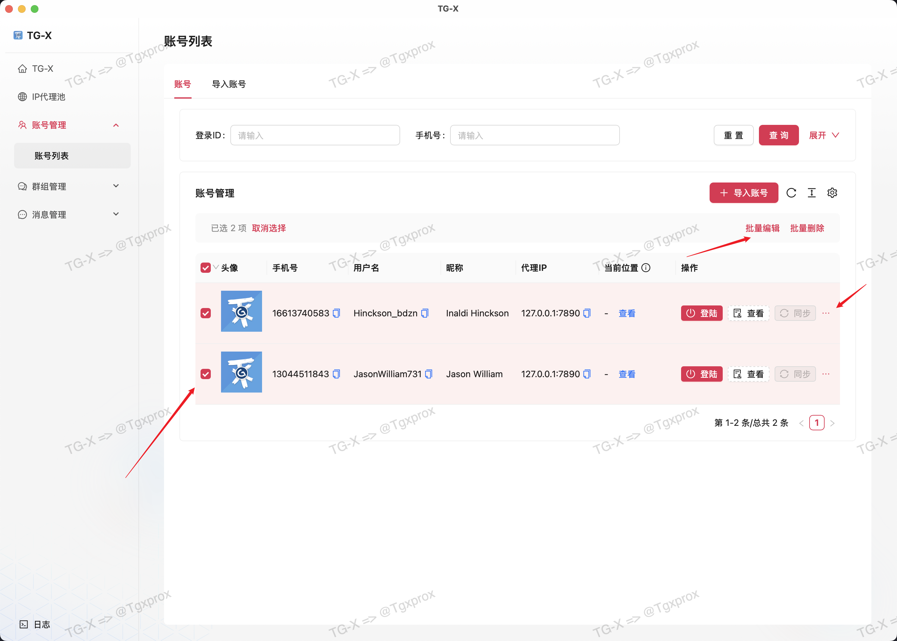
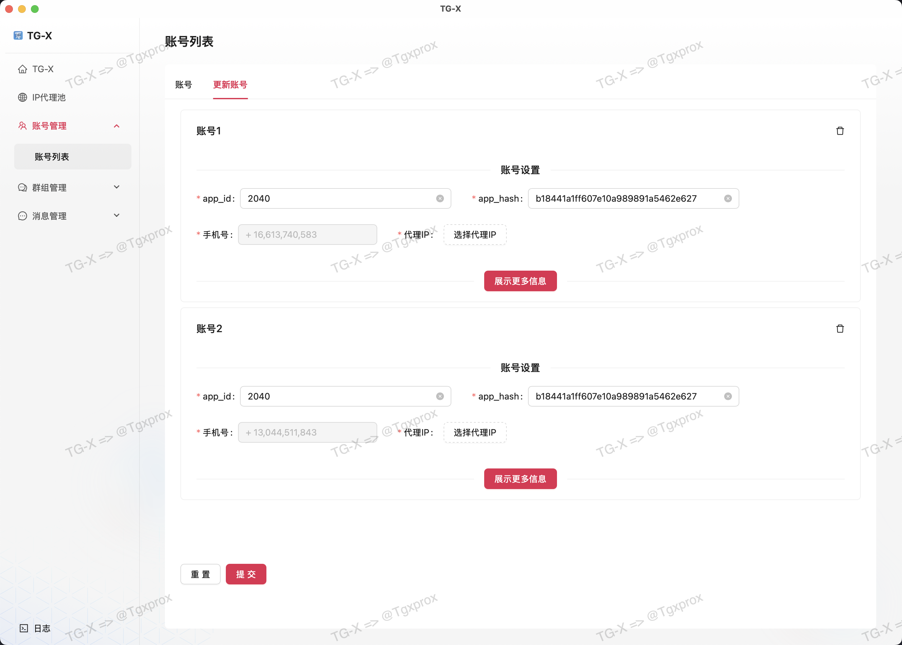
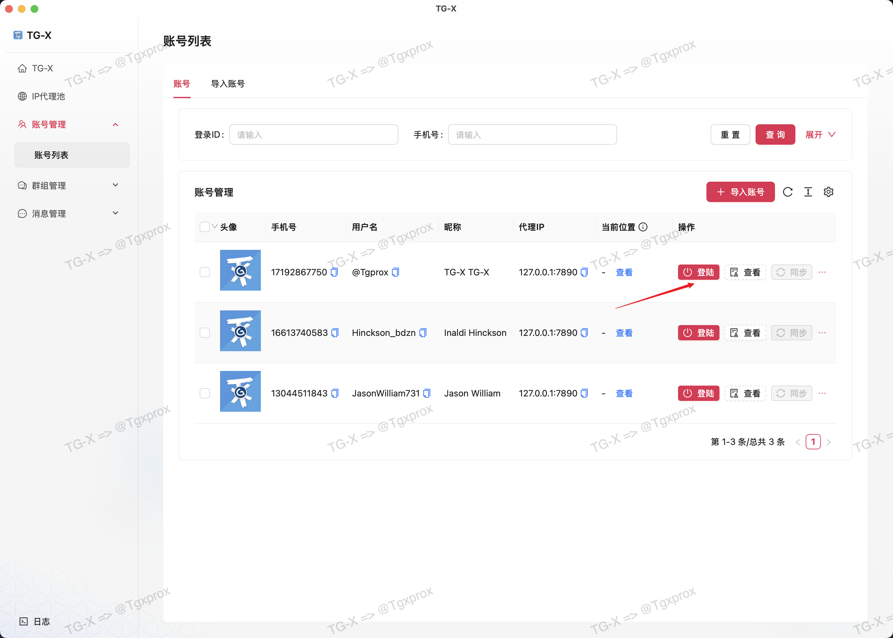
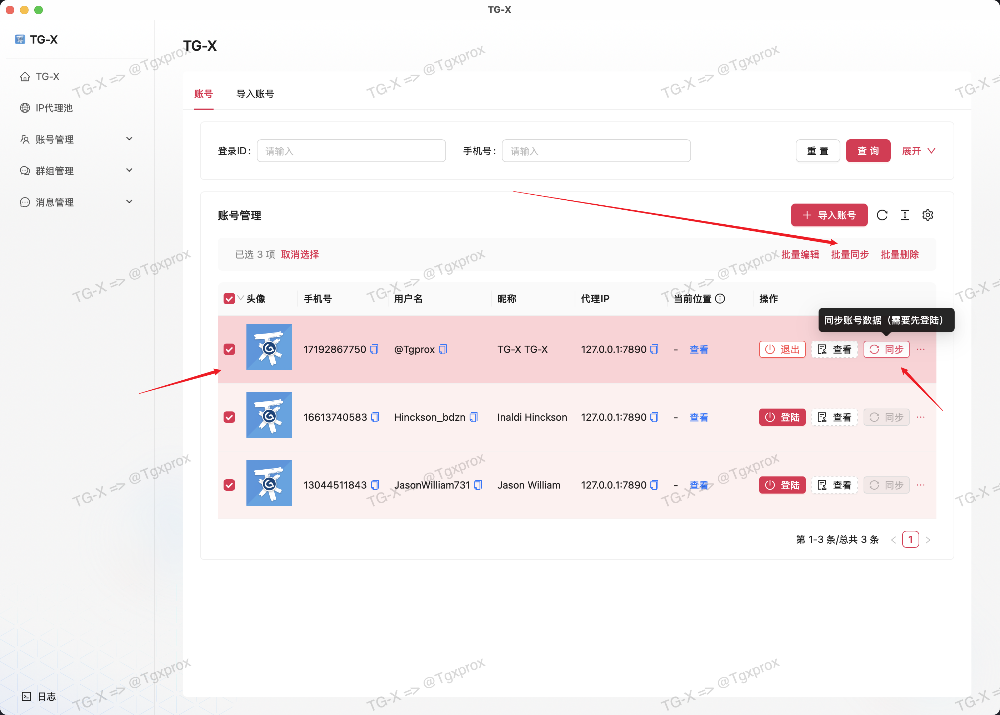
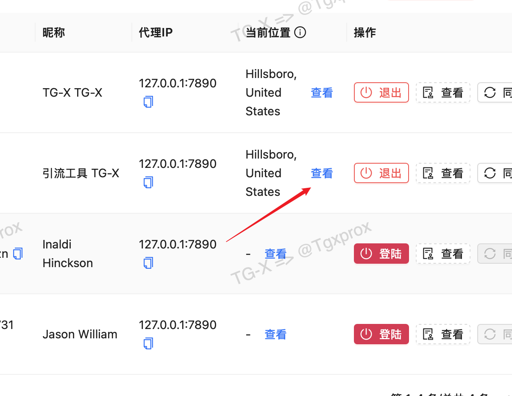

# 🛡️ 账号管理

::: tip
 分布式账号管理系统｜IP隔离技术实现零关联｜99.9%账号存活率保障｜AI智能风控预警
:::

## 编辑账号

::: info
编辑账号与导入时的页面一支，在这里修改的 **信息会先保存到本地数据库中**
:::

## 登陆账号

::: info
软件所有操作都需要先登陆账号，在登陆之前一定要把 IP 代理设置好
:::

## 同步账号

::: info
账号登陆成功后，可以点击同步功能，把修改的数据都同步到 telegram 的数据库

实现批量修改账号信息，多用于广告号矩阵
:::

## 查询地址

::: info
在登陆后可查询代理 IP 地址是否正确
:::

::: tip
一切准备就绪后即可开始矩阵操作

- ✅ 账号成功登陆
- ✅ 账号基本信息同步成功
- ✅ 账号IP地址正确

:::