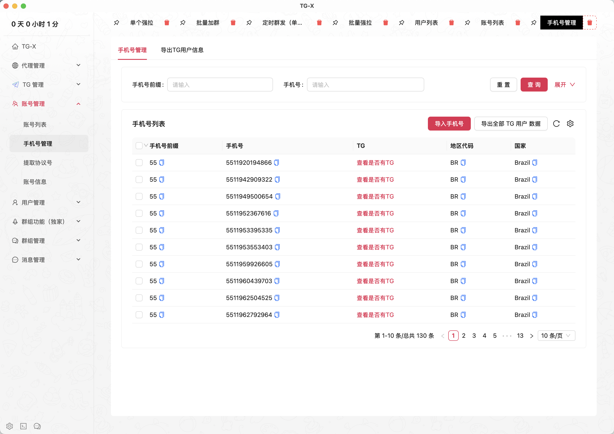
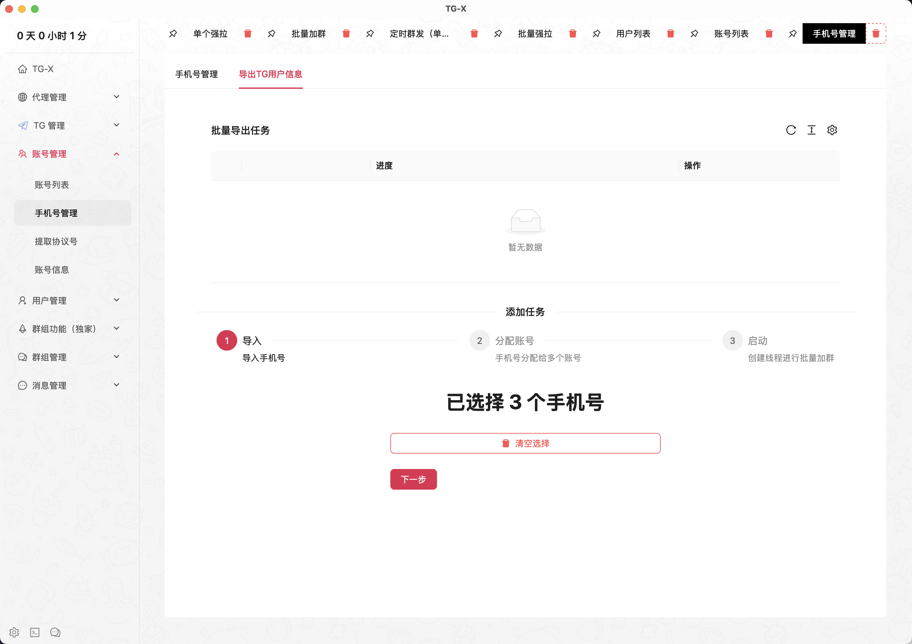
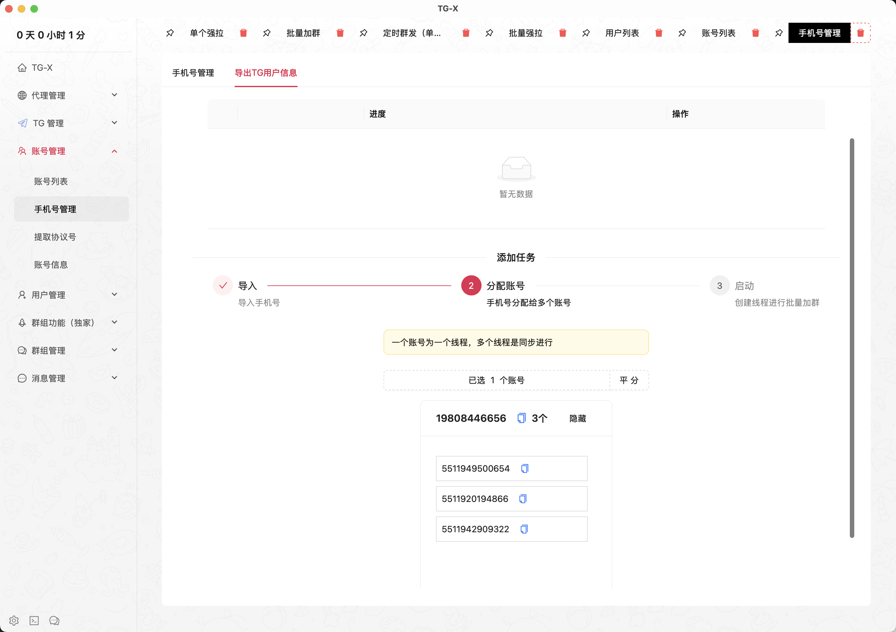
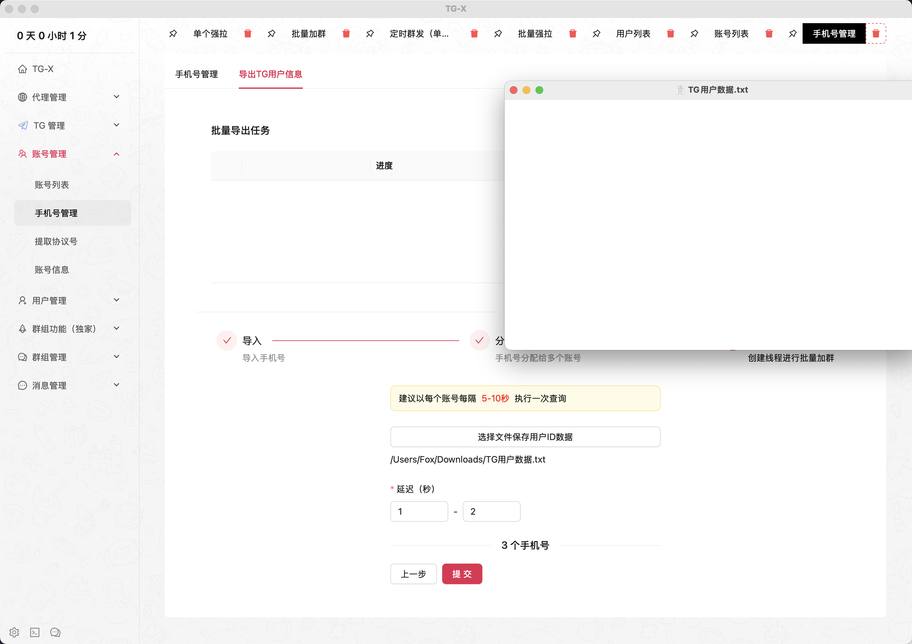
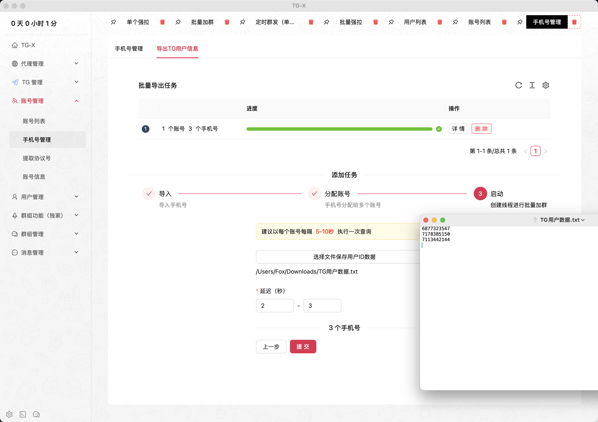
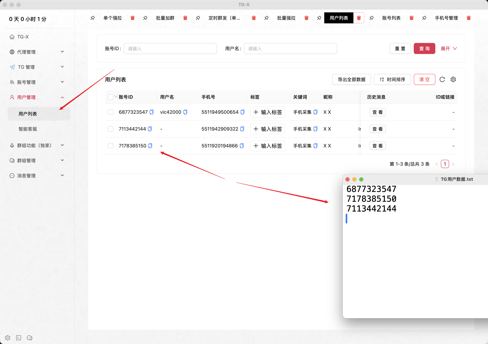

# 📞 手机号管理

::: tip
一键管理上千手机号，自动分析手机号国家，根据手机号精准采集TG用户
:::

## 手机号采集 TG 用户

<VideoLink type="手机号采集"  />

## 导入手机号

## 选择要导出信息的手机号

## 选择账号

## 设置任务参数和保存数据文件

> 文件仅支持 .txt 格式

## 创建任务并启动

## 在用户列表中查看详细用户信息

