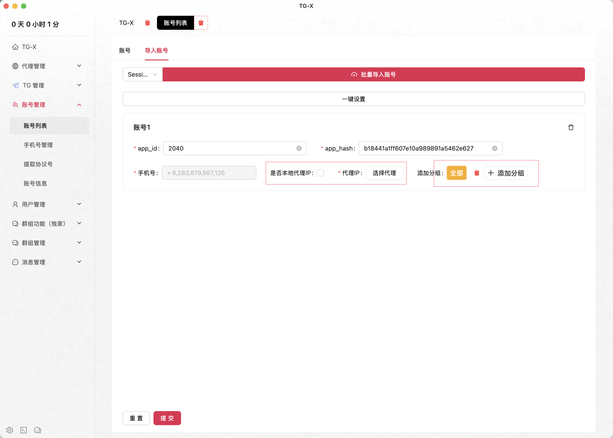

# ⚡️ 批量导入

::: tip
 分布式账号管理系统｜IP隔离技术实现零关联｜99.9%账号存活率保障｜AI智能风控预警
:::

<VideoLink type="账号矩阵"  />

## Session 批量导入账号

::: info
session 账号文件，与对应的 Json 信息文件，从号商购买获取
:::

## 压缩包直接批量导入账号

::: info
这里仅支持 `.zip` 和 `.rar` 的压缩包格式，且这个压缩包中必须有 `session 账号文件，与对应的 Json 信息文件`
:::

### 在导入这里主要设置

::: info
代理IP导入请看 👉 [代理IP导入](../proxy/ipproxy.md)
:::

- 代理IP
- 分组标签

## 更新账号信息

::: info
可一键设置所用账号信息进行统一管理
:::

### 点击一键设置

::: info
这里所有设置都是可选的，不需要每次都全部填写，只需要填你要更改的选项即可
:::

### 账号信息

- 基本信息
- 设备信息
- 其他信息

### 基本信息

::: info
用于账号的基本展示信息
:::

### 1.头像
> 自行设置
### 2.左昵称
> 官方账号
### 5.右昵称
> TG-X
### 3.简介
> TG-X 引流工具
### 4.用户名
> @Tgxprox

### 设备信息

::: info
这些设备信息在购买的号商那已经处理完成，也可自行修改

设备信息主要用途是更好的减少封控
:::

### 1.设备名称
> iPhone 12
### 2.系统版本
> iOS 17.5.1
### 3.应用版本
> 3.4.3 x64
### 4.账号语言
> en
### 5.系统语言
> en-US
### 6.系统SDK
> Linux XFCE Wayland glibc 2.33

### 其他信息

::: info
这些信息主要是账号相关和活动时间的信息，可根据这个信息判断购买的账号是否有异常
:::

### 1.TG账号ID
> 7578148215
### 2.账号密码
> 123456
### 3.二级密码
> 98ulj
### 4.注册时间
> 2025-03-24T12:26:49+08:00
### 5.最后一次检查时间
> 2025-03-24T12:26:49+08:00
### 6.最后连接日期
> 2025-03-24T12:21:42+08:00
### 6.会话创建日期
> 2025-03-24T12:21:42+08:00
