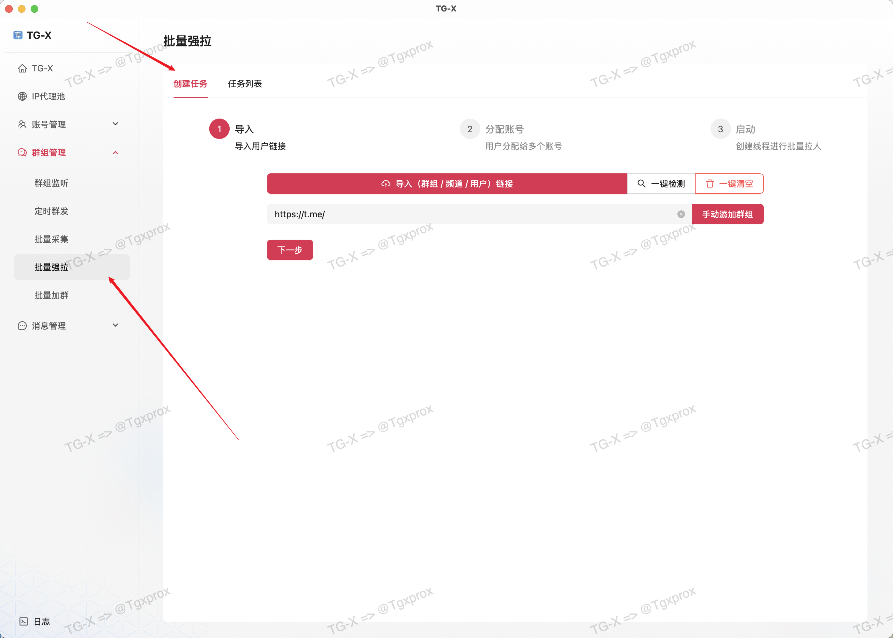
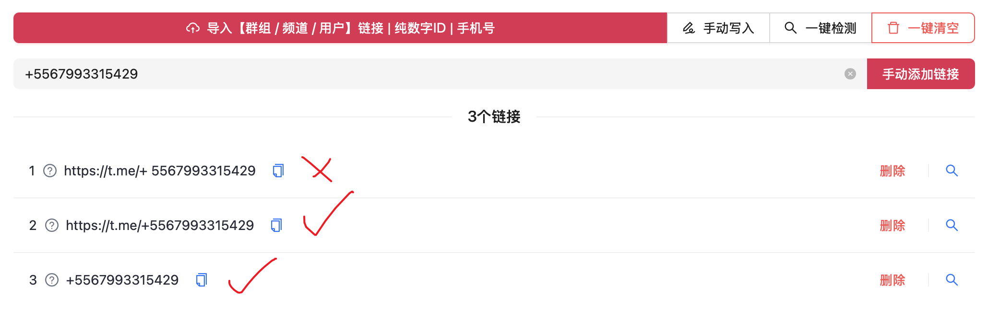
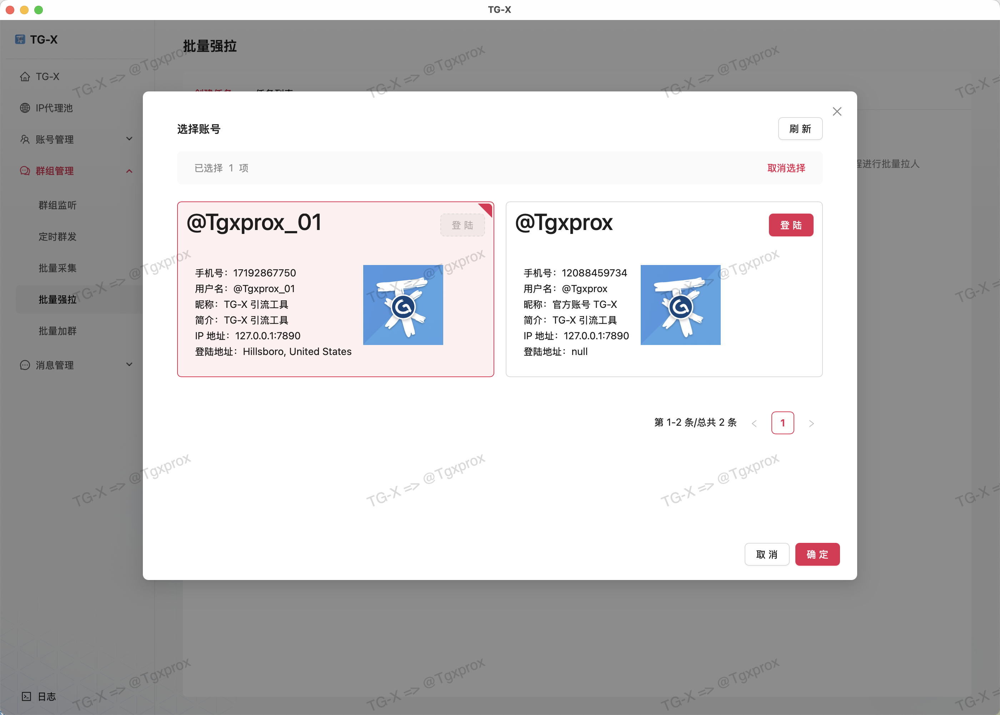
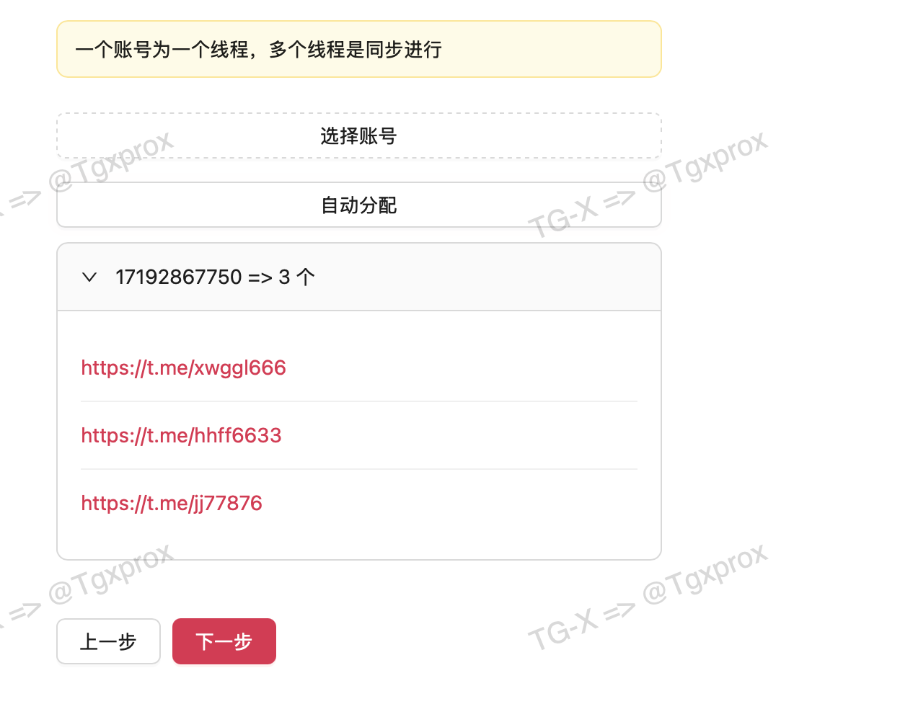
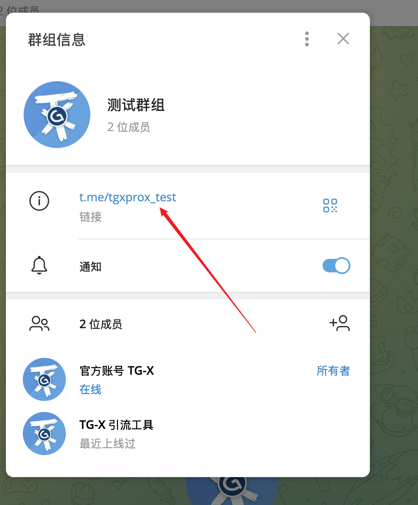
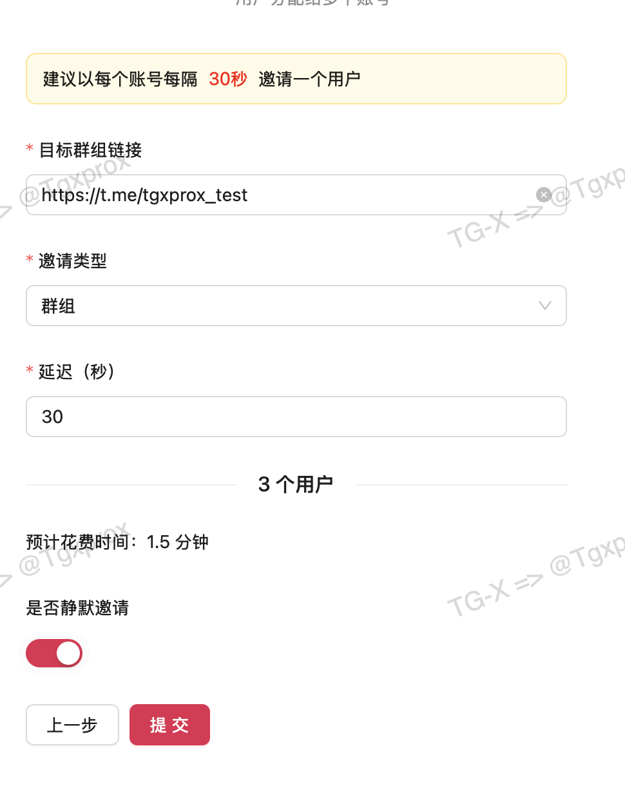
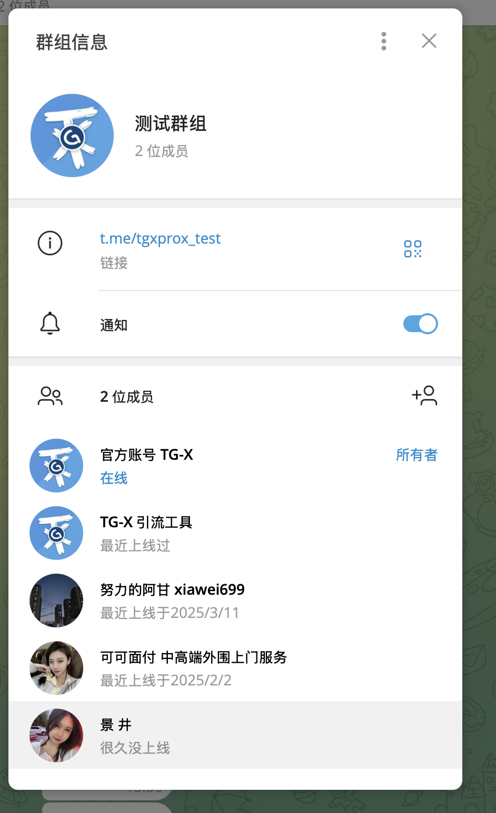
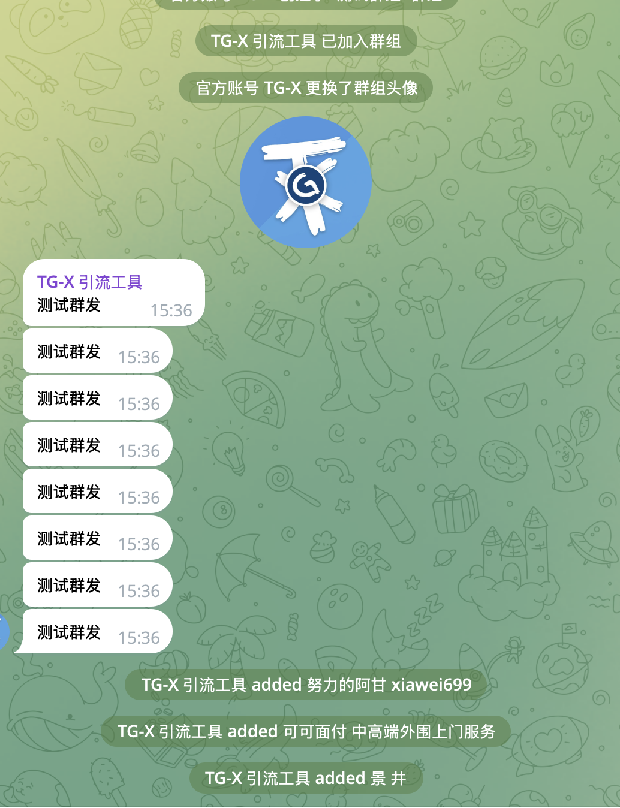

# 🤖 批量强拉

::: tip
多协议混合操作｜自然增长算法｜真人行为模拟｜日均万级用户导入
:::

<VideoLink type="单个强拉"  />

## 导入用户

::: info
这里我准备了 3 个用户
:::

::: warning
导入目前仅支持 txt 格式，多个链接以换行分割
:::

## 支持手机号直接解析

::: warning

- ❌ `https://t.me/+ 5567993315429` 在 `+ 5` 中不能有空

- ✅ `https://t.me/+5567993315429`

- ✅ `+5567993315429`

:::

## 检测过滤掉无效链接

## 分配账号

::: warning
这里必须选择已登陆的账号才能执行
:::

## 设置目标群组 / 频道

::: warning
这里必须选择已登陆的账号才能执行
:::

::: warning
这里必须选择已登陆的账号才能执行
:::

## 结果展示

