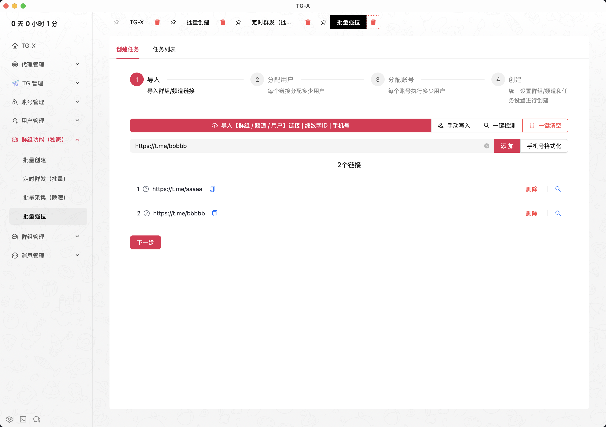
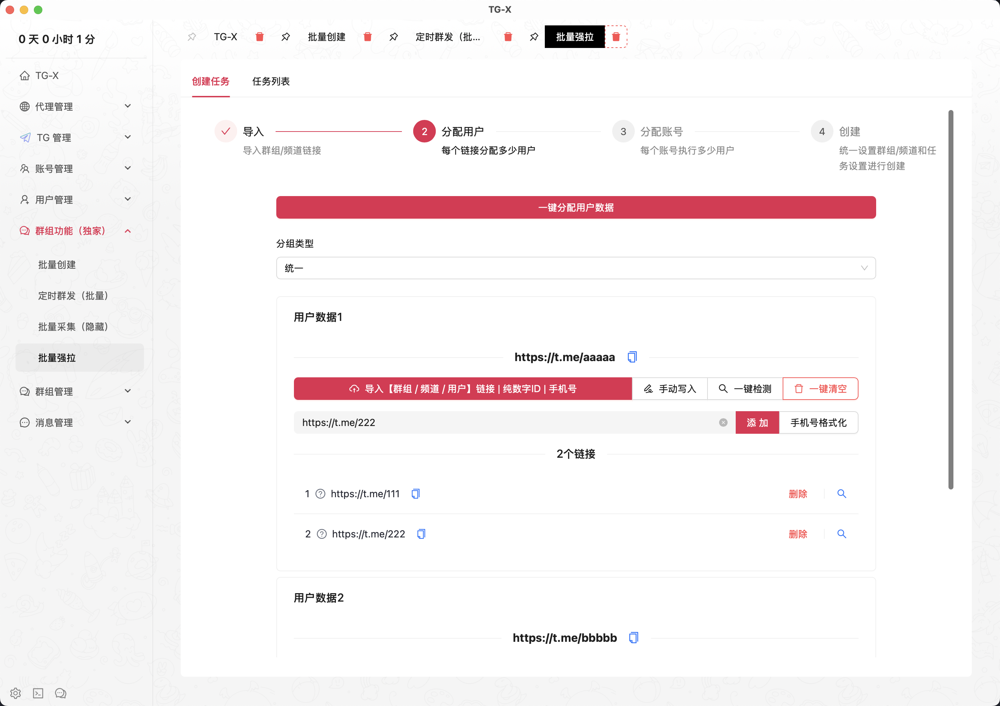
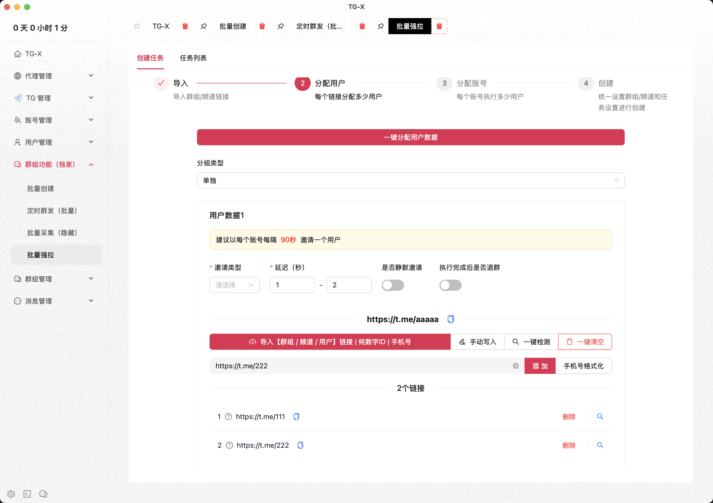
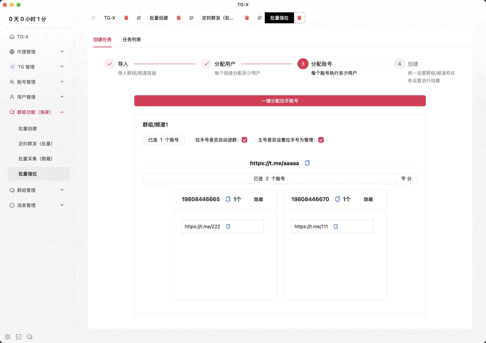
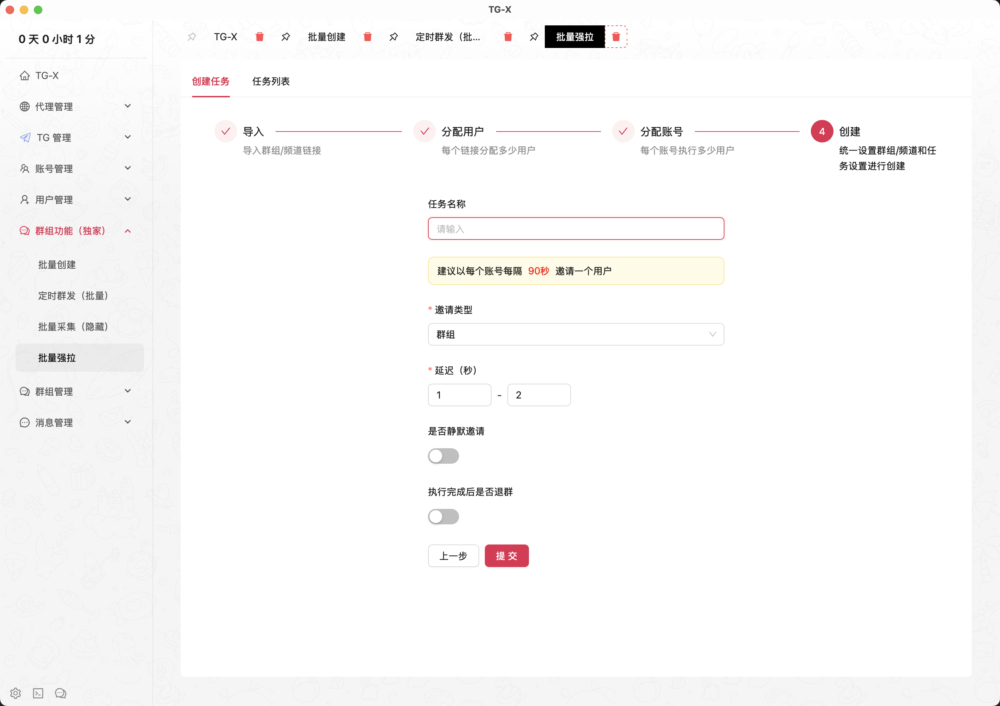

# 🤖 批量强拉

::: tip
多协议混合操作｜自然增长算法｜真人行为模拟｜日均万级用户导入
:::

<VideoLink type="批量强拉"  />

## 导入链接

::: info
导入需要拉人的（群组或频道）链接
:::

## 设置拉取的用户

### 可单独设置每个链接的任务参数

## 分配账号

::: info
这里的需要注意的是，主账号必须在群或者频道链接中，并且有管理员权限且可以设置其他账号为管理员
:::

## 统一设置任务参数

