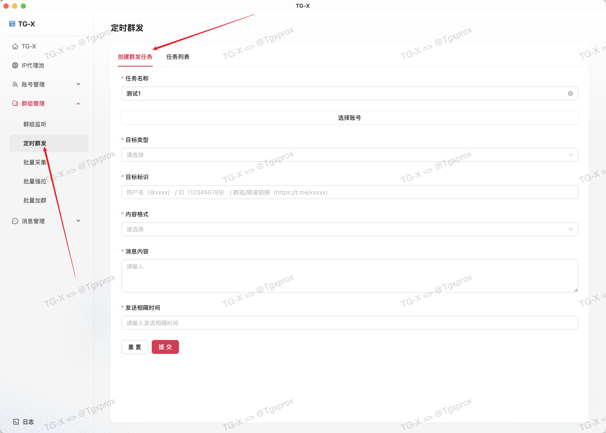
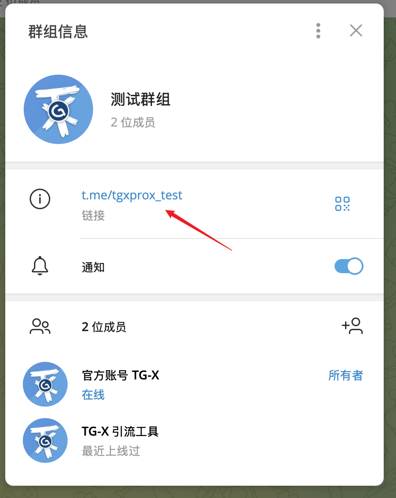
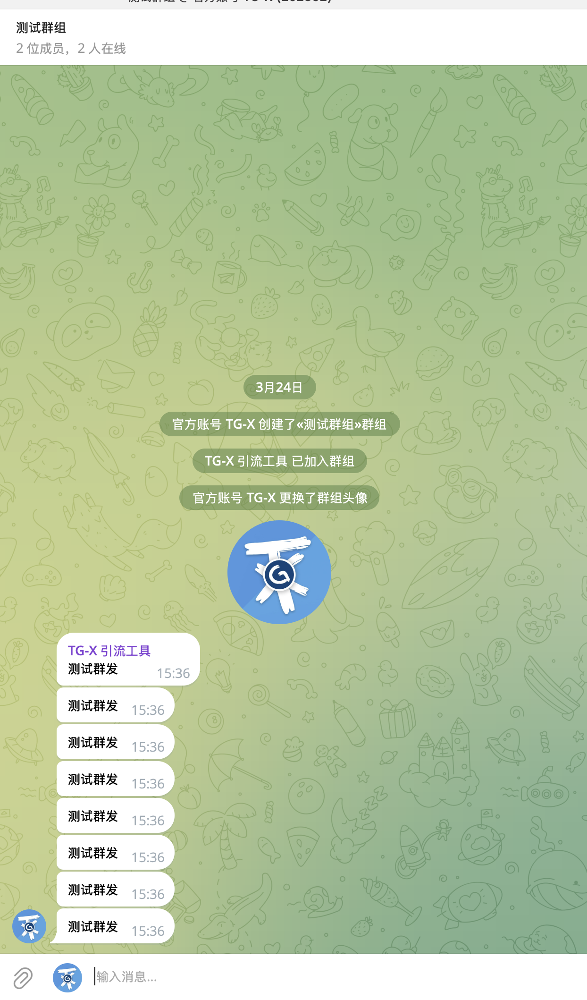
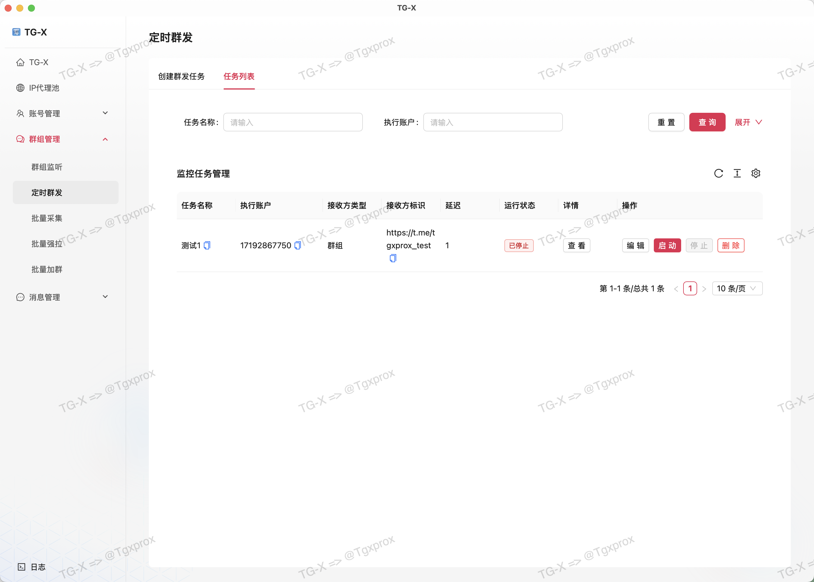

# 🎯 定时群发

::: tip
百万级消息并发能力｜智能时段优化算法｜多媒体内容支持｜99%消息到达率保障
:::

<VideoLink type="定时群发"  />

## 创建任务

## 选择账号

## 复制目标群组链接

## 设置发送内容

> [!WARNING]
> ⚠️ 注意这里的相隔时间是以秒为单位，1000 = 1000 秒，大家请计算好相隔时间并转化成秒来执行

> [!IMPORTANT]
> 可以看到我刚刚设置的每隔一秒执行，运行非常快

> [!WARNING]
> ⚠️ 注意在创建任务的同时会立即开启任务

## 任务列表

::: tip
创建任务后的数据会保存在本地数据库，可实现：

- ✅ 自定义启动任务
- ✅ 随时暂停任务
- ✅ 多次编辑任务
- ✅ 删除任务
:::