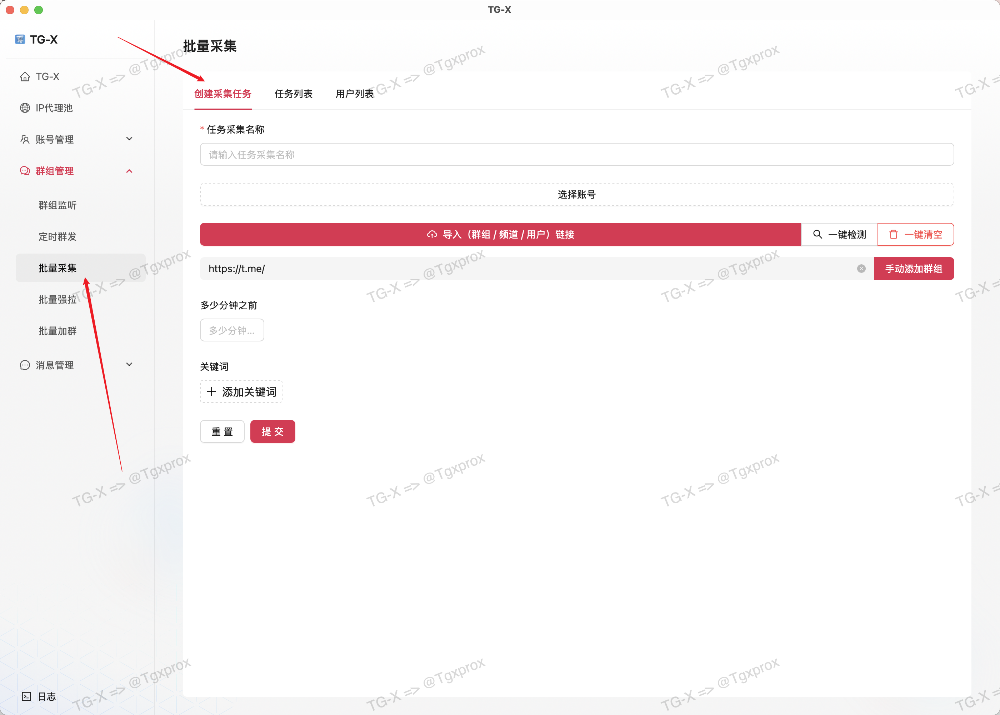
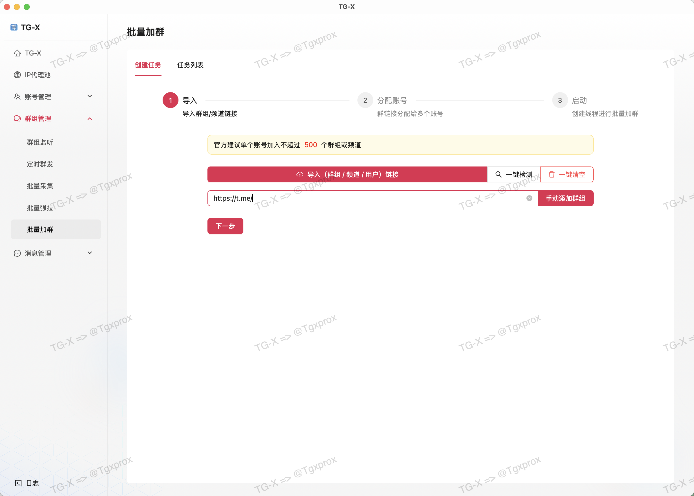
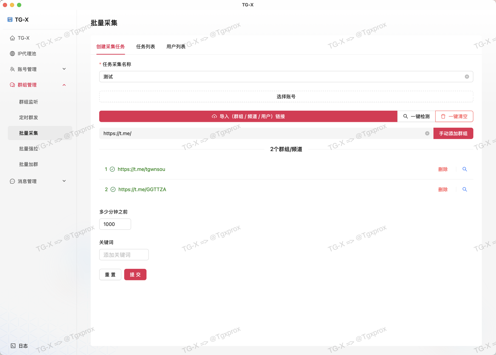
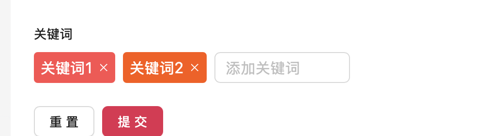

# ⛏️ 批量采集

::: tip
全类型用户采集技术｜突破隐私限制｜每小时10万+数据采集｜自动清洗无效用户

这个采集任务可以采集任何已加入的群组，并且是多线程协调工作，一秒上千条
:::

## 创建任务

::: warning
这里必须选择已登陆的账号才能执行
:::

## 导入群组 / 频道

::: info
这里我准备了 3 个群组，有一个是无效链接，我们来看测试结果
:::

::: warning
导入目前仅支持 txt 格式，多个链接以换行分割
:::

## 检测过滤掉无效链接

## 设置活跃时间

::: info
这里的活跃时间是以当前时间开始计算往前推多少多少分钟

例如我这里是 1000 分钟 ，那么就是从现在时间 减去 1000 分钟
:::

## 设置关键词

::: warning
关键词可选，可以设置多个关键词，如果不设置默认采集所有用户
:::