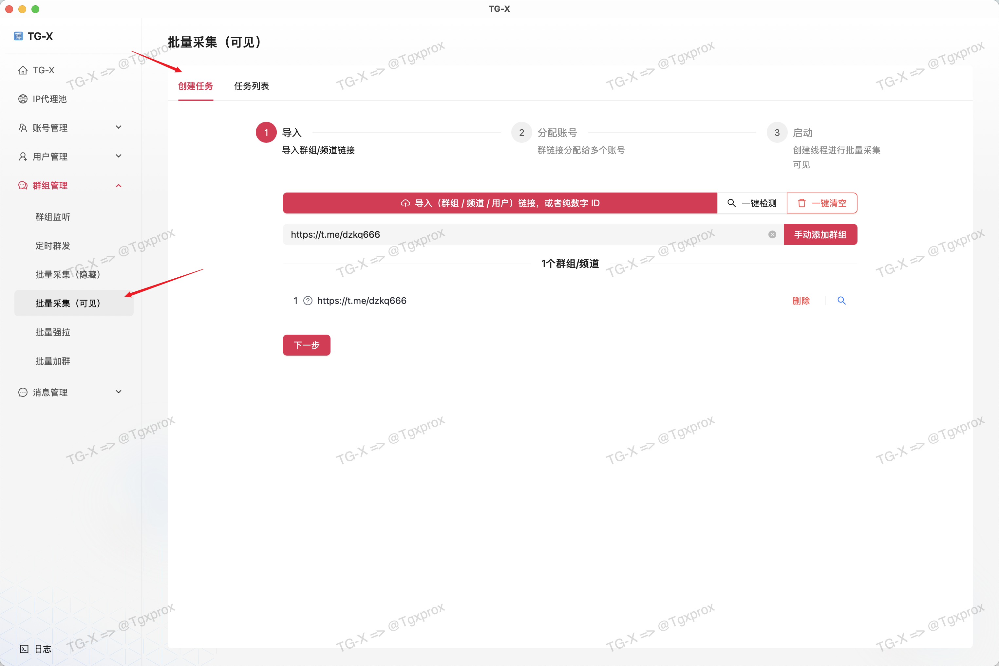
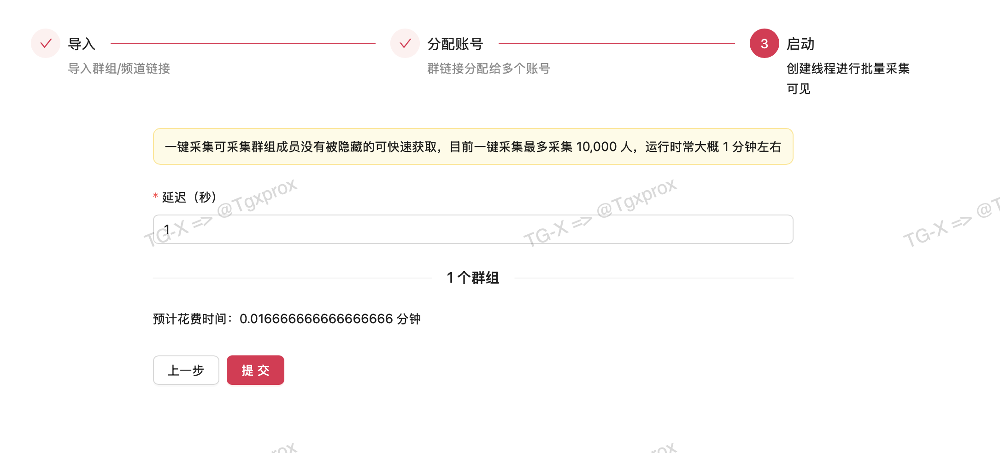
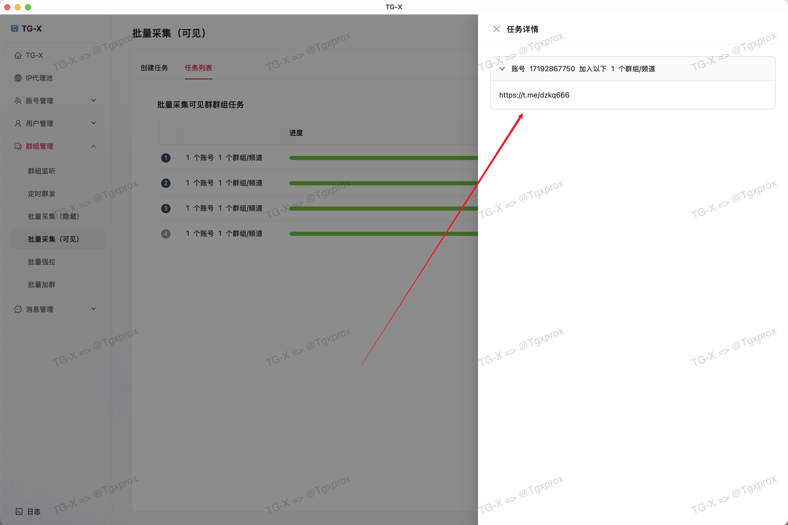

# ⛏️ 批量采集（可见）

::: tip
可创建批量任务进行一键导出群出成员，适用于可见用户群中，支持超 10,000 + 的群组一键导出
:::

<VideoLink type="采集可见"  />

## 创建任务

::: warning
这里必须选择已登陆的账号才能执行
:::

## 导入群组

::: info
这里我准备了 3 个群组，有一个是无效链接，我们来看测试结果
:::

::: warning
导入目前仅支持 txt 格式，多个链接以换行分割
:::

## 检测过滤掉无效链接

## 分配账号

::: warning
这里必须选择已登陆的账号才能执行
:::

## 设置延迟

::: warning
这里的单位是 秒
:::

## 查看任务

