# 📡 群组监听

::: tip
2000+群组同步监听｜关键词智能触发系统｜即时私信/自动回复/精准转发｜用户画像实时生成
:::

## 视频查看

- [Telegram](https://t.me/tgxproc/14)
- [YouTube](https://t.me/tgxproc/14)
- [Twitter](https://t.me/tgxproc/14)
- [TikTok](https://t.me/tgxproc/14)
- [哔哩哔哩](https://t.me/tgxproc/14)

## 创建任务

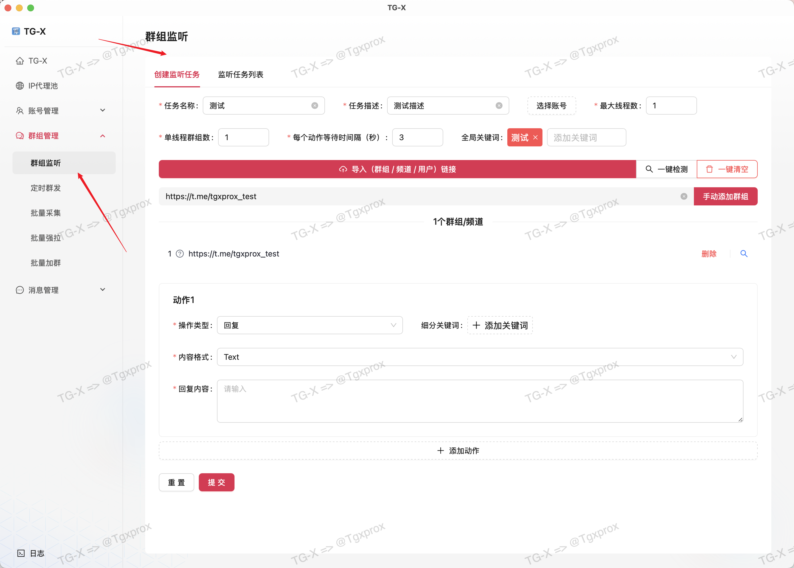

## 导入群组 / 频道

::: info
这里我准备了 3 个群组，有一个是无效链接，我们来看测试结果
:::

::: warning
导入目前仅支持 txt 格式，多个链接以换行分割
:::

## 检测过滤掉无效链接

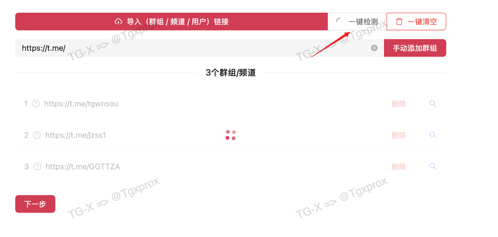

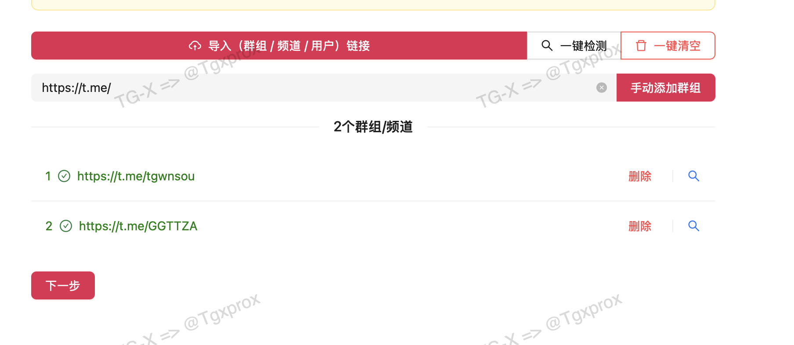

## 参数说明

### 最大线程数

这里的线程设置的 `单个任务` 在 `监听群组任务` 时候都线程数

::: info

简单点理解就是：
- 我要监听10个群组
- 我消耗本地多少个线程去管理

:::

### 单线程群组数

::: info

这里与上面的线程数关联

例如我开起了 5 个线程，去管理 20 个群组

这里你可以设置单线程管理 4 个

那每个线程就分配到 最多 4 个群组
:::

### 每个动作等待间隔（秒）

::: info
这里的动作间隔就是我执行一个任务动作后需要等待多久后在执行下一个
:::

### 全局关键词

::: info
这里的关键词代表任务触发的关键词，可以设置多个

简单理解就是只有匹配的才会执行任务
:::

关键词匹配规则是包含关系，例如：

- 用户输入文本：我需要买 `号`
- 关键词设置的：号
- 这个就满足条件
- 这时候就会出触发设置的任务

## 动作任务

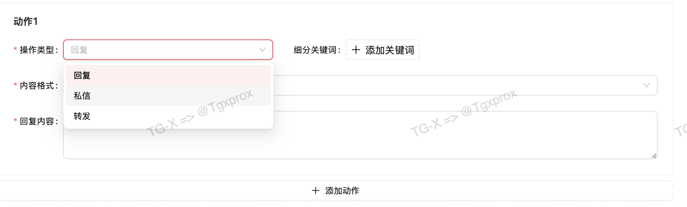

> 目前动作支持以下类型

- 回复
- 私信
- 转发

### 回复动作

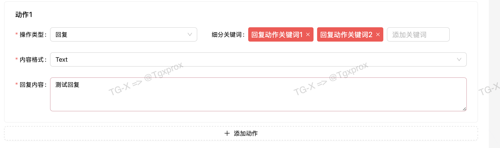

### 私信动作

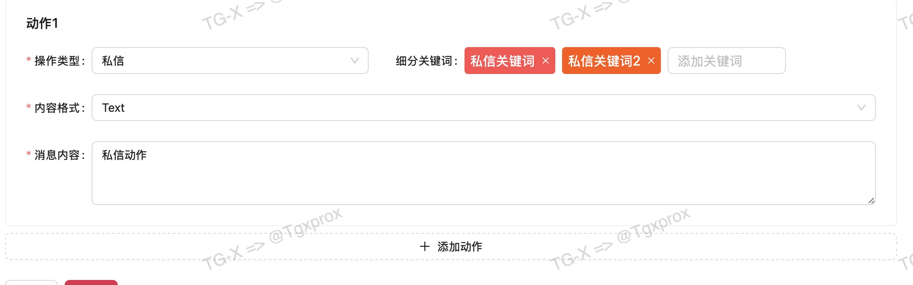

### 转发动作

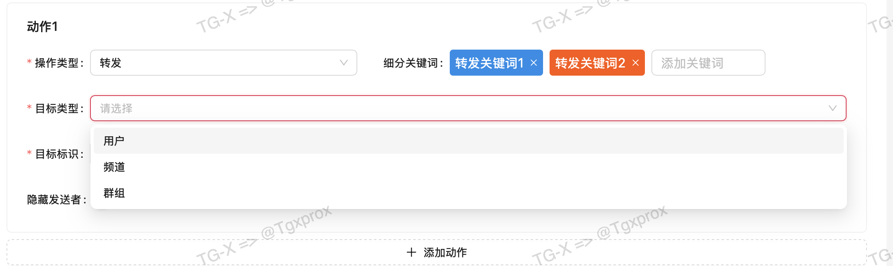

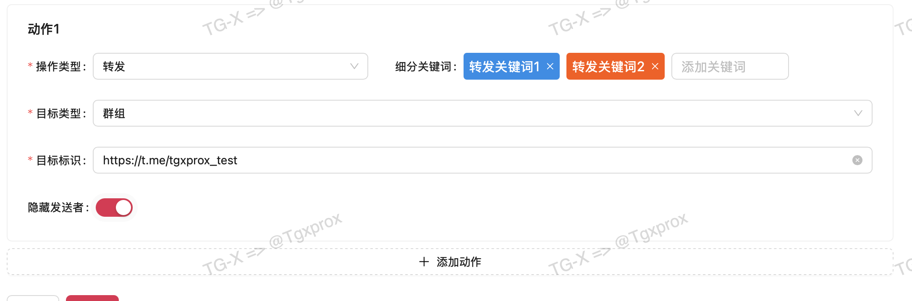

## 多动作执行

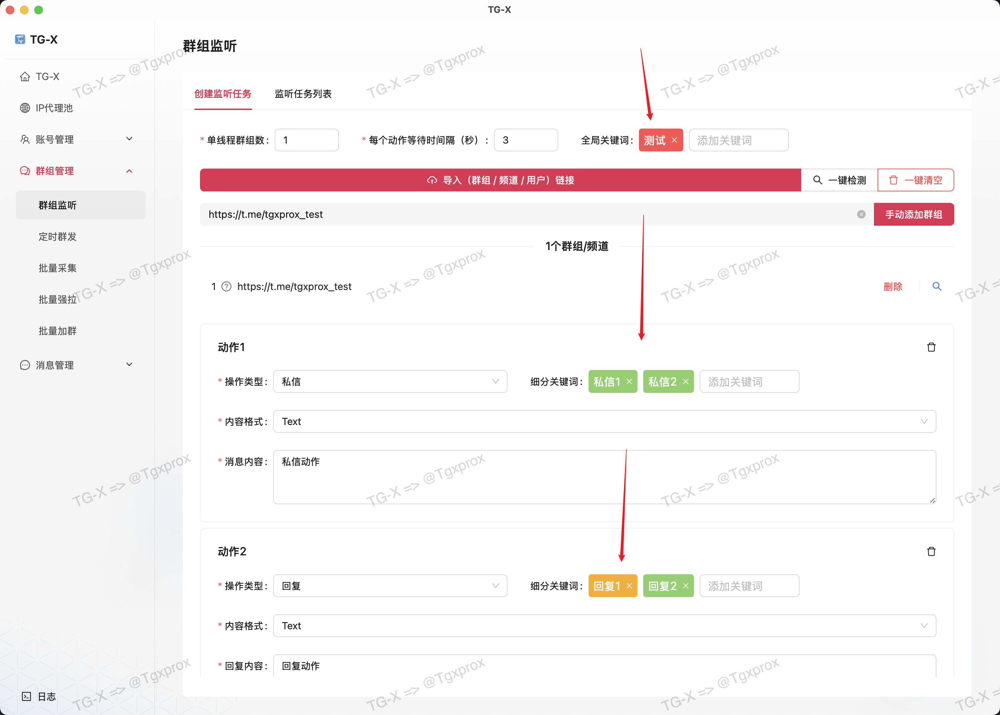

::: tip
在添加多个动作的时候，执行顺序会按照添加顺序来执行
:::

### 关键词匹配顺序：

- 全局 => 然后在到动作关键词

### 匹配规则：

- 必须先满足全局关键词，在匹配动作关键词

### 示例：

全局关键词

> 你好

动作1关键词 

>买号
--- 
> 用户发送：`你好`，我要 `买号`

动作匹配结果：全局 ✅，动作 ✅ = ✅

> 用户发送：`你好`，谁有飞机号我要买

动作匹配结果：全局 ✅，动作 ❌ = ❌

## 测试案例

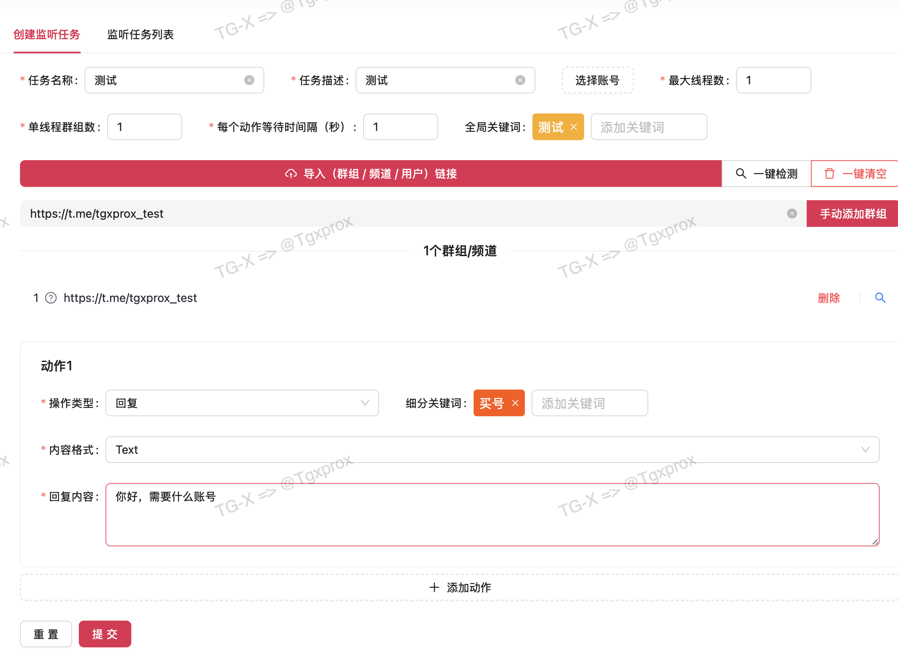

::: tip
这里我以回复为例：

- 全局关键词：`测试`

- 动作关键词：`买号`

- 执行动作回复：`你好，需要什么账号`
:::

## 效果展示

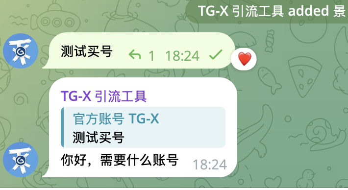

## 任务列表

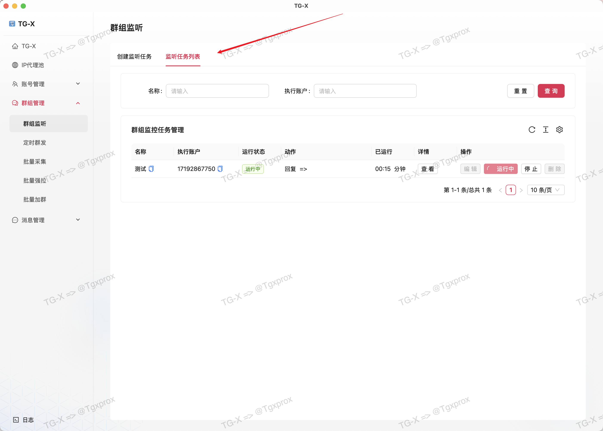

::: info
在任务列表中可以对创建的任务进行，增、删、改、查。

- 观察任务状态
- 可手动暂停任务
- 可随时启动任务
- 可删除任务
:::
