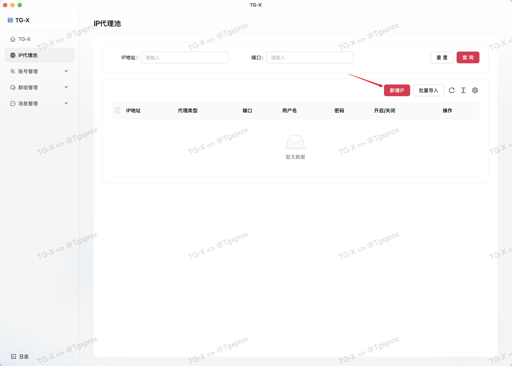
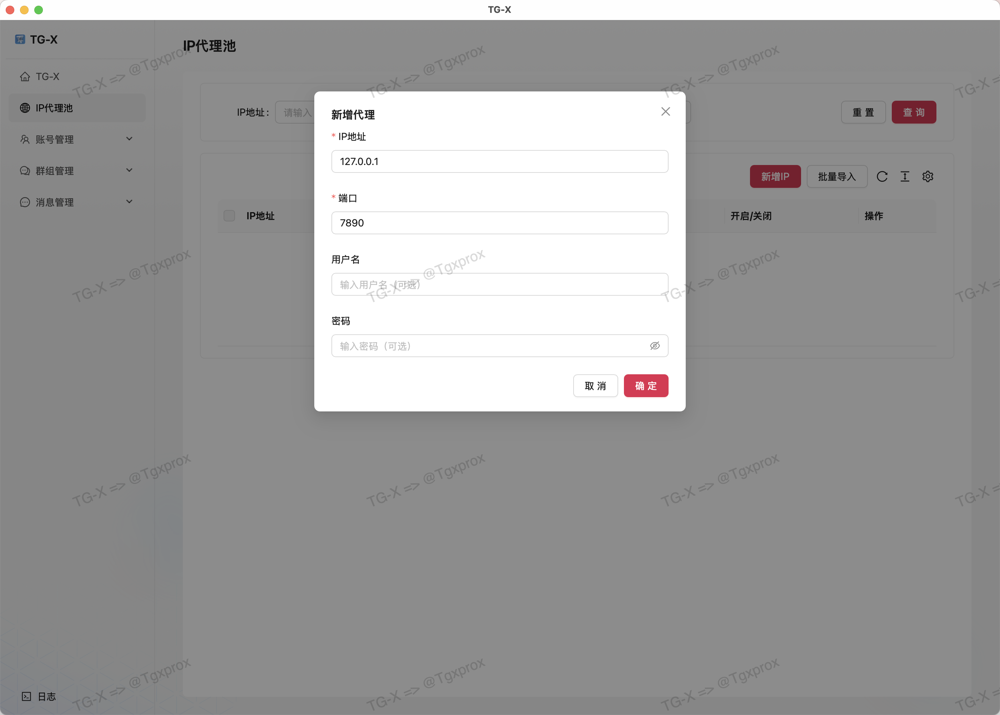
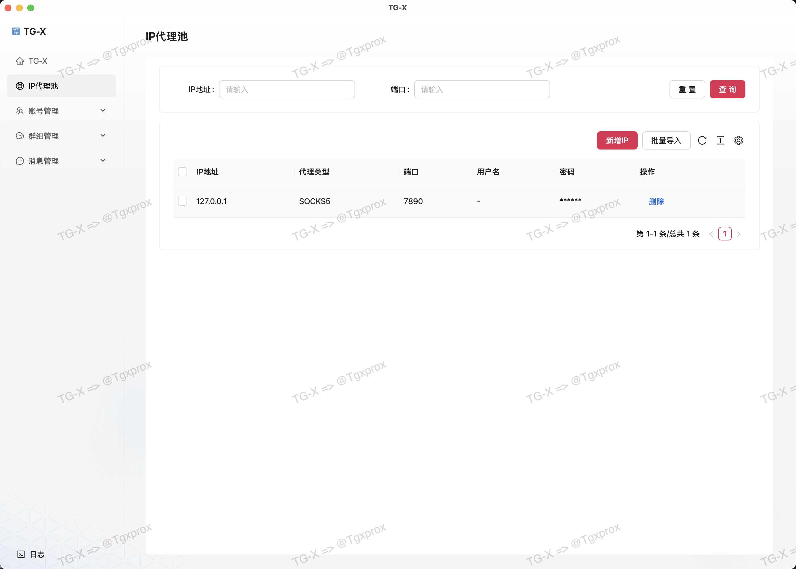
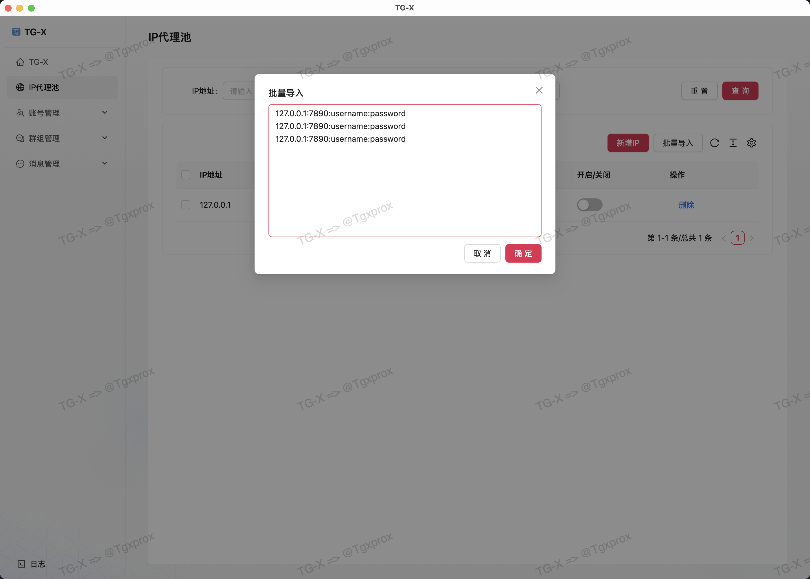

# 🛜 IP 代理池

::: tip
建议一定要用 双 ISP ❗️❗️❗️ 的 IP，这样账号就不会死的太快
:::

## 添加代理IP地址

::: info
我这里测试演示就添加本地代理 127.0.0.1:7890 端口，**（这个本地代理地址根据你的设置来添加）**

账号和密码根据你购买的代理商进行配置，可为空
:::

## 批量导入

::: warning ⚠️

注意这里的输入格式是，必须是英文符号的 `:`，中文符号的 `：` 没办法导入，多个 IP 以换行结尾，如果没有 username 和 password 可以不写

127.0.0.1:7890:username:password

127.0.0.1:7890:username:password

127.0.0.1:7890
:::

