# AnXra双节点配置（安卓使用）

自备一个自己的节点，自己节点什么类型的就添加什么类型。我自己的是新加坡的，就以这个为例

点击添加，手动输入

首先添加这个新加坡的节点，新加坡的节点是V2的，协调端口是VMess就选这个，对应选择。

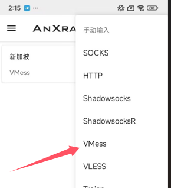

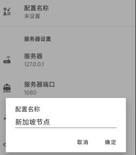

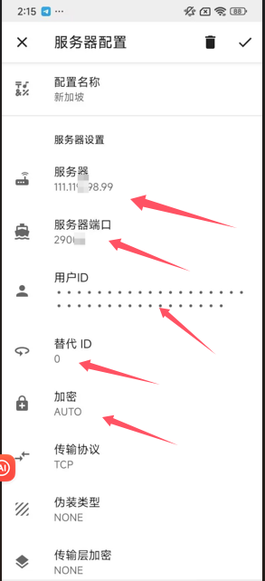

对应填入相关信息，点击保存按钮。

再添加一个

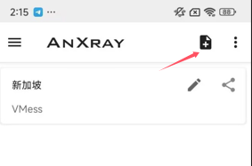

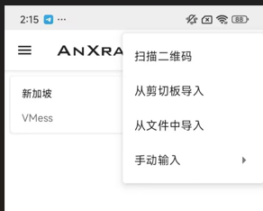

这个纯净度高的宽带我们选择socks

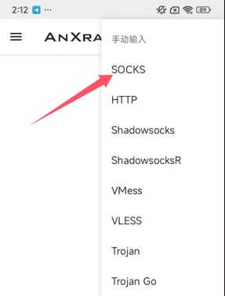

对应的输入信息

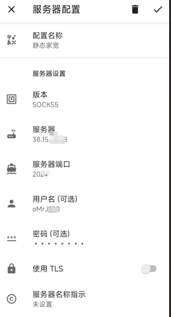

点击保存，会出现红色先不用管

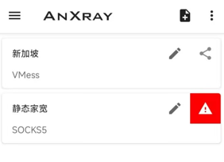

再点击添加

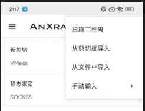

手动输入里面，下拉到最后，选择链式代理

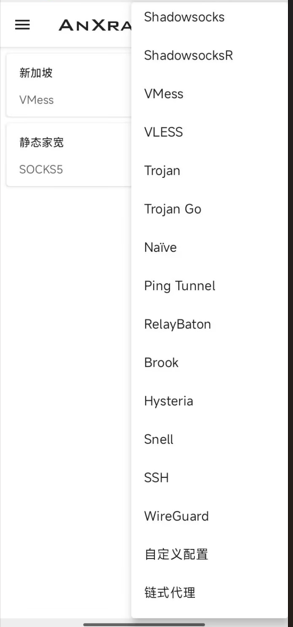

点击添加服务

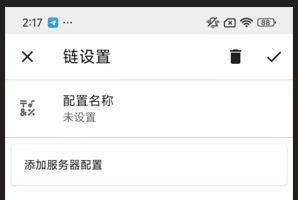

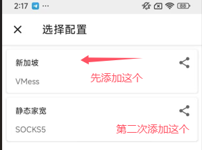

保存之后就是下面这种的，点击下面的链式代理链接。

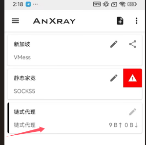

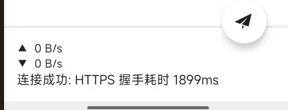

链接成功后，去网站输入查询[ipinfo.io](http://ipinfo.io/)

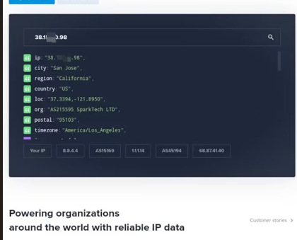