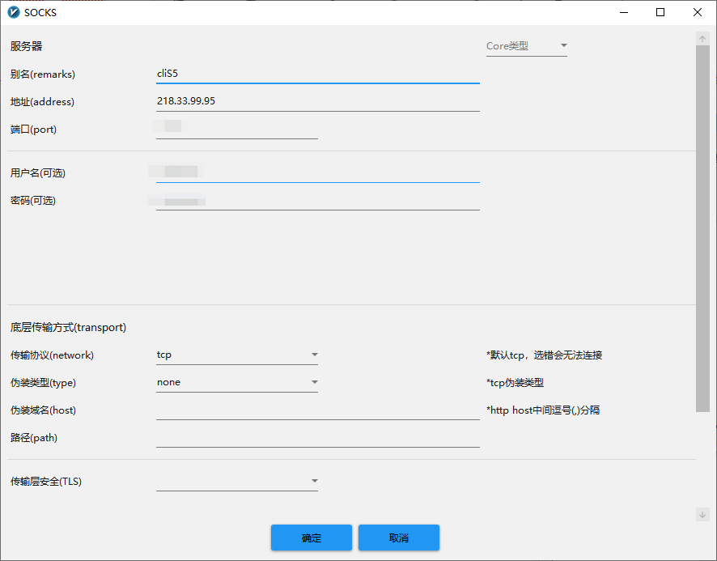
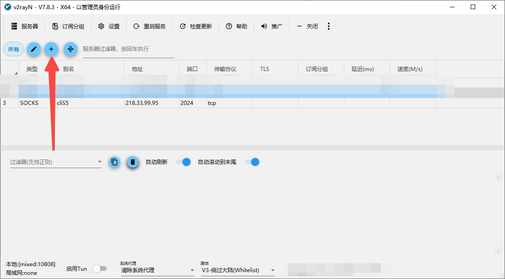
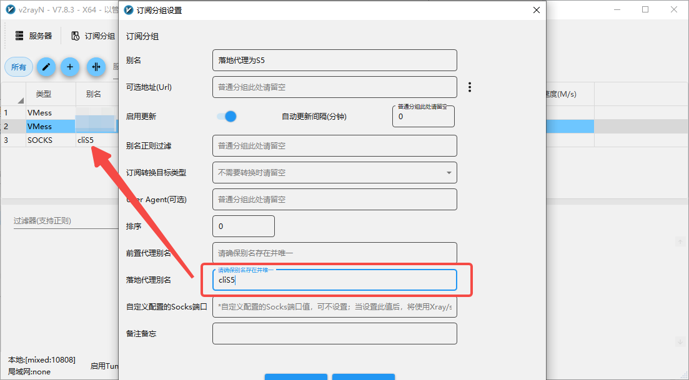
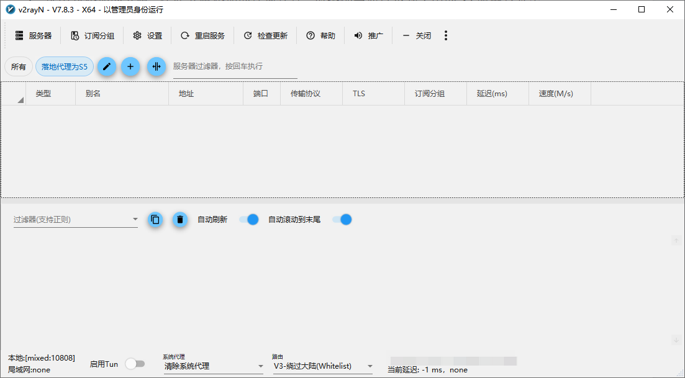
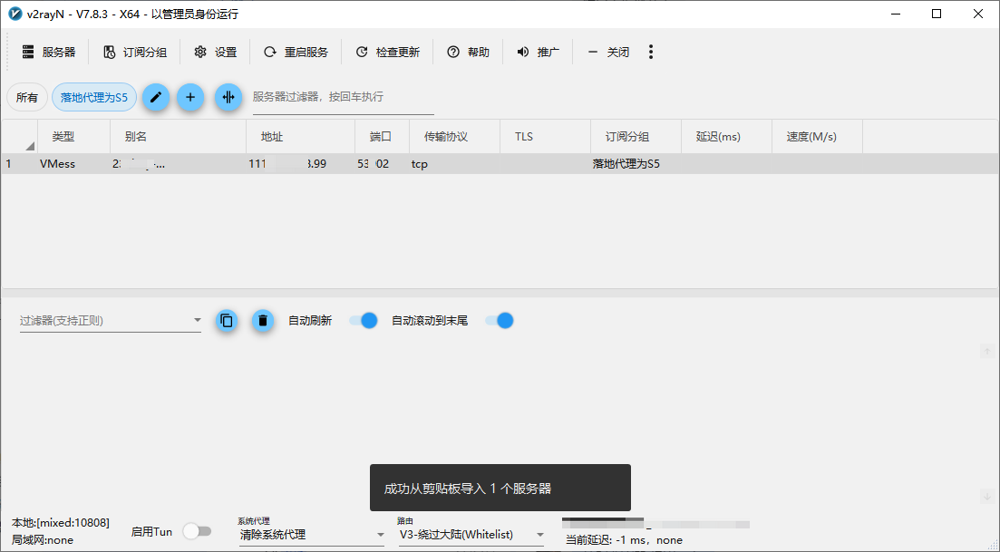
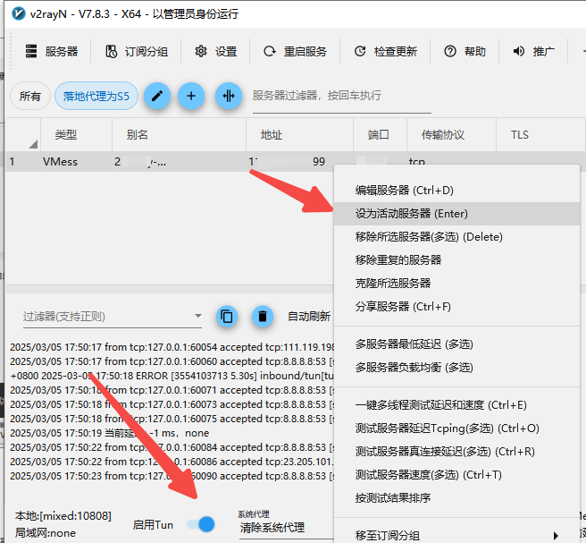
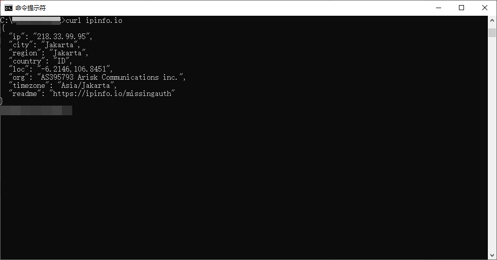
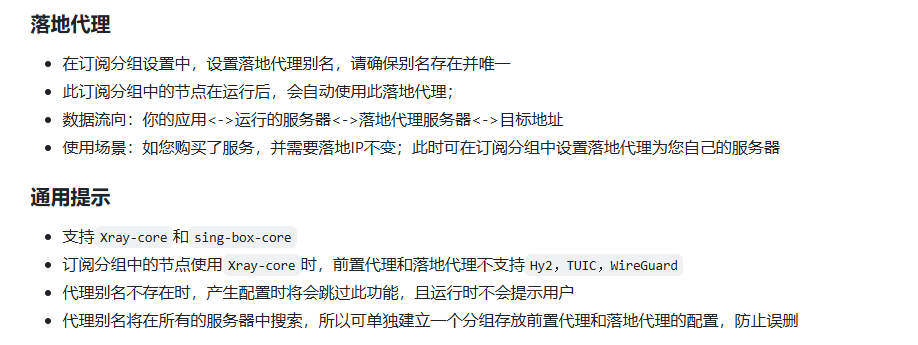

# V2rayN 如何配置链式代理

V2rayN说明文档:https://github.com/2dust/v2rayN/wiki/Description-of-proxy-chain

把自建的代理设置为落地代理,如果需要把自建的代理设置为前置代理则反向操作即可

1. 在V2rayN添加自建的S5节点 提前记录好别名信息(cliS5)
    
    
    
2. 添加订阅分组
    
    
    
    
    
3. 选中新添加的分组，在此分组添加的任何代理，最终都会通过步骤1中的S5服务器发出
    
    
    
    例如在此分组添加一条VMESS协议的节点,并设为活动服务器开启Tun模式,此时本机IP仍然为步骤1中的S5服务器的地址（自己原来的节点是什么格式的就导入哪个就可以，原来有的可以直接使用）
    
    
    
    
    
    
    
    