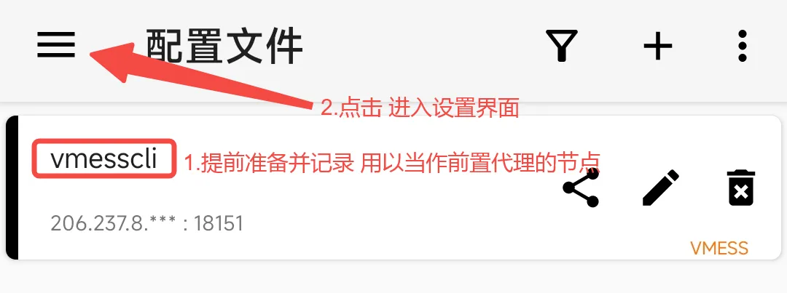
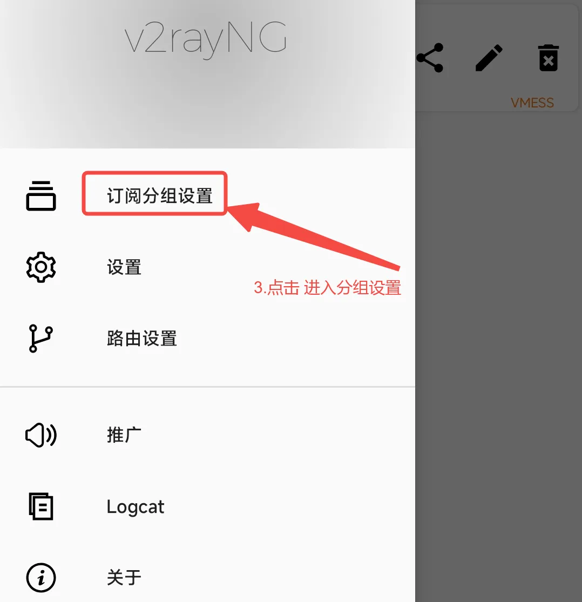
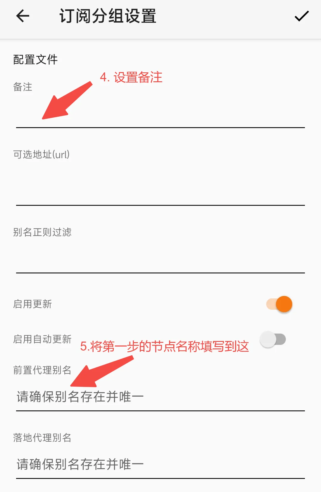
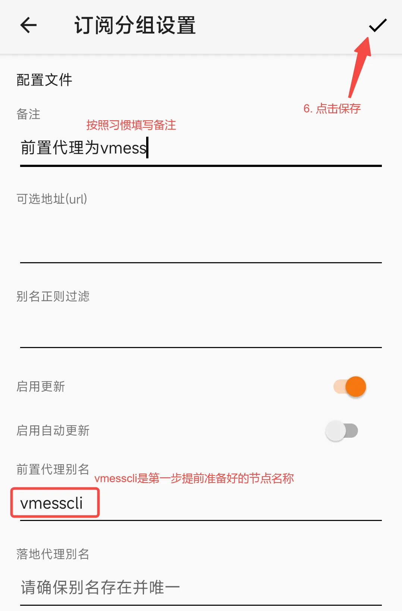
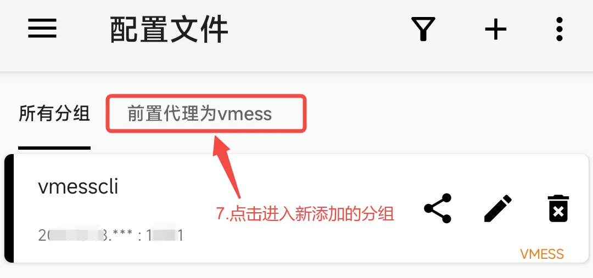
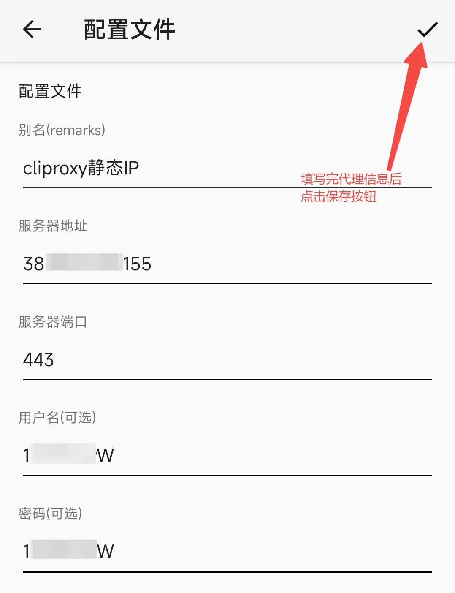
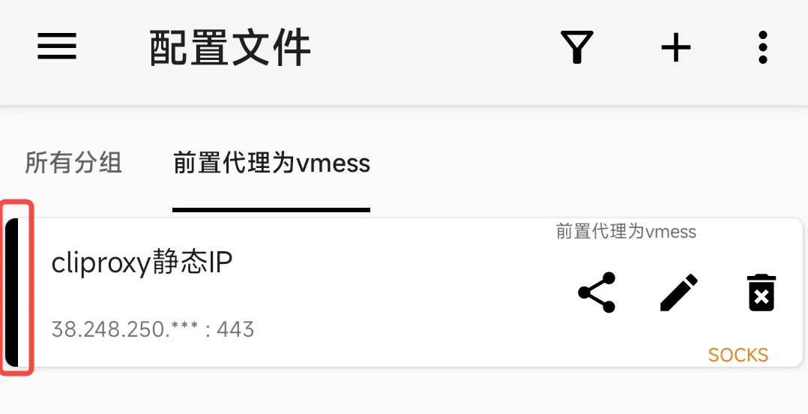

# V2rayNG 链式代理

1. 打开V2RayNG,提前准备好用来充当前置代理的节点( 这是自己自备的节点)，记录节点名称之后会用到

2. 点击左侧”三”按钮进入设置页面

   

   3、点击”订阅分组设置” 进入分组设置

   

   4、如图所示填写备注信息

   5、将提前准备好的节点名称填入至前置代理处

   

3. 填写完后保存,

   

4. 保存完会显示刚添加的分组 点击进入

   

5. 在添加的分组里 添加Cliproxy的代理信息

   

6. 选择Socks5或者HTTP协议 并填写对应的代理信息:服务器地址、服务器端口、用户名、密码

   

7. 点击添加的Cliproxy节点 将节点设置会活动节点。直接使用就可以

   请注意在V2rayNG中活动节点前方有一个黑色线条