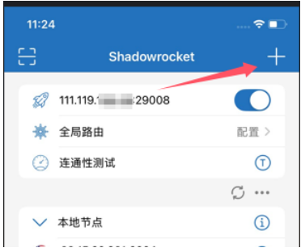
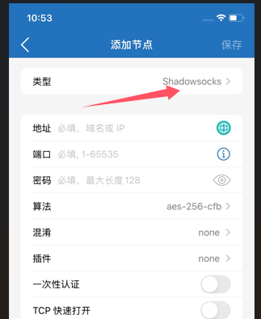
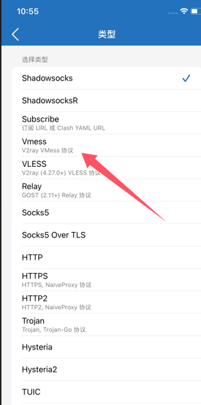
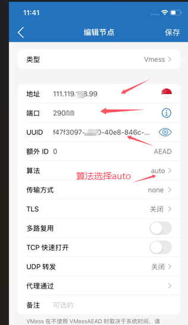
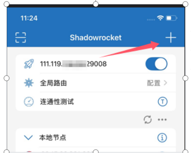
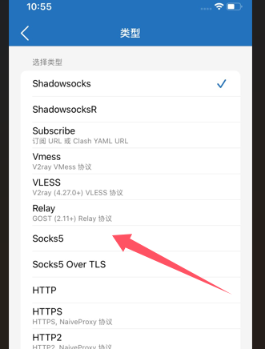
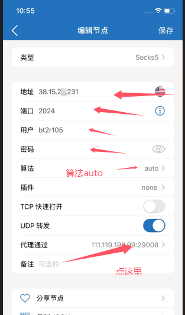
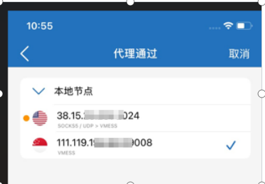
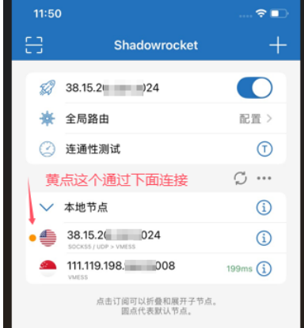
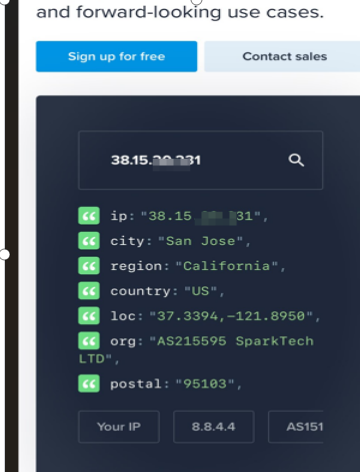

# 小火箭如何配置双节点（苹果使用）

首先需要自备一个自己的节点，自己的节点是什么协议的，就添加什么协议的，我这里自己的是新加坡的，就以这个为例。

点击添加按钮。

这里用的新加坡的节点，这个节点的类型是V2ray的，就选vmess这个的，选择节点对应的协议

对应的添加上点击保存就行，放那先不用管

再来添加一个链接

点击类型选择添加的类型这次需要选的的类型是socks5，静态住宅ip的节点

对应填入对应的地址，端口，用户名和密码

返回界面

意思就是美国的节点通过新加坡的连接，这个时候就可以用ipinfo.Io测试了，已经显示是美国的加宽了

