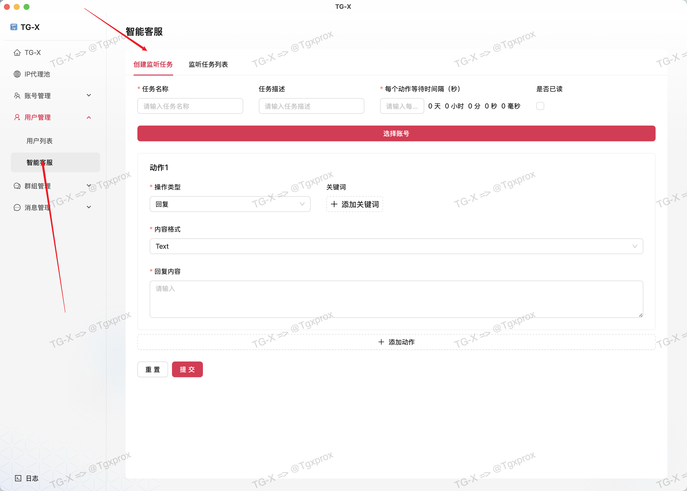
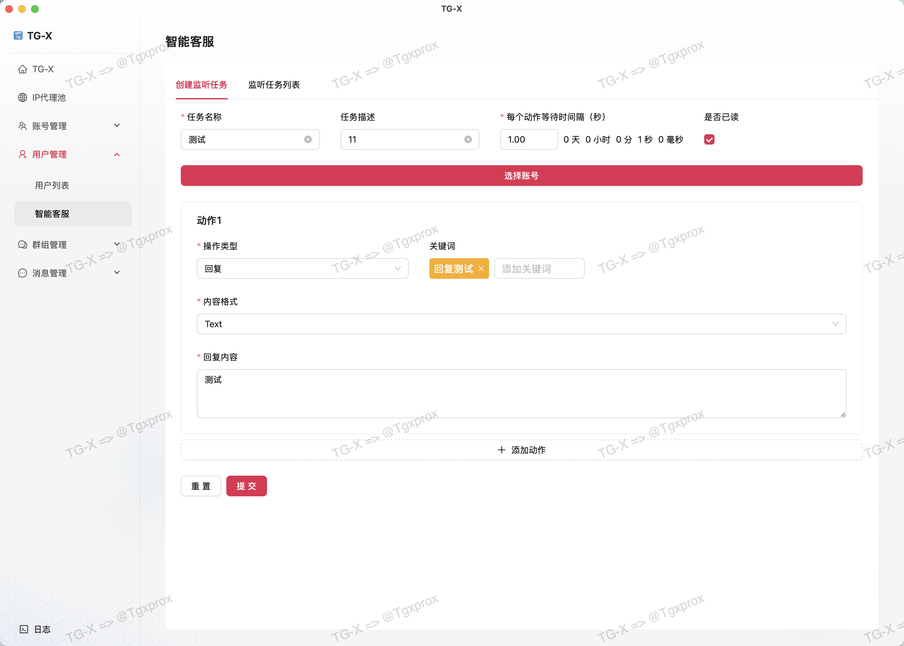
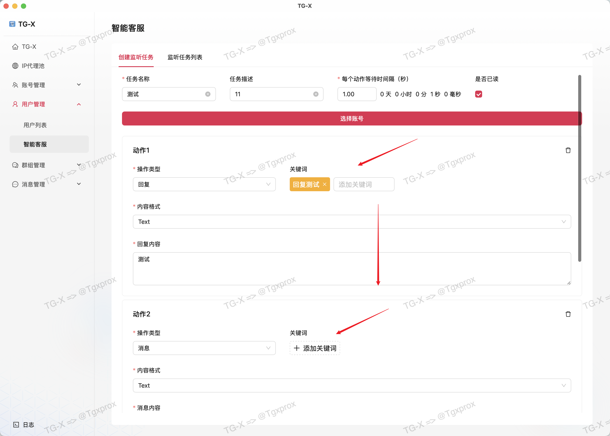

# 👩‍🔧 智能客服

::: tip
0.3秒极速响应｜AI语义理解｜20+矩阵多账号管理7×24小时不间断服务
:::

<VideoLink type="智能客服"  />

## 添加任务

## 参数说明

### 每个动作等待间隔（秒）

::: info
这里的动作间隔就是我执行一个任务动作后需要等待多久后在执行下一个
:::

## 动作任务

> 目前动作支持以下类型

- 回复
- 私信
- 转发

### 回复动作

### 私信动作

### 转发动作

## 多动作执行

::: tip
在添加多个动作的时候，执行顺序会按照添加顺序来执行
:::
