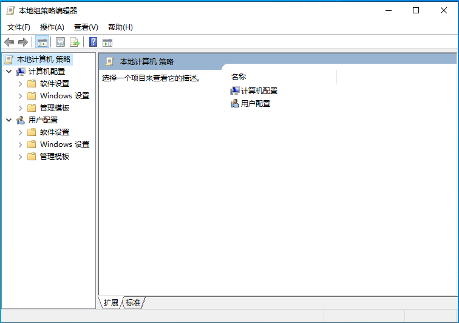

# 🫆 如何永久关闭windows安全中心？

Windows10系统中自带了windows defender杀毒软件，也就是Windows安全中心。

虽然大家在日常使用中不太能体会到它的存在，但你准备安装一些激活软件或者没有经过微软认证的第三方软件时，就疯狂来展现它的存在感了。

不经过你允许就直接删除你的文件。

明明压缩包有文件，解压出来确空空如也。

就算你关闭它，短时间内后台也会自动开启。

今天就教大家如何永久关闭windows defender杀毒软件。

## 第一种方式

安装某一杀毒软件，比如某管家、某60，杀毒软件会覆盖Defender优先起作用！

## 第二种方式

这种方法适合“x奔”

1、在键盘上按快捷键【WIN+R】 或者鼠标右击桌面左下角Windows图标，选择【运行】弹出运行窗口。

2、输入【gpedit.msc】，然后点击【确定】，打开【本地组策略编辑器】

3、在【本地组策略编辑器】-【计算机配置】中依次打开【管理模板】、【Windows组件】、【Microsoft Defender防病毒】

4、在【Microsoft Defender防病毒】中双击【关闭Microsoft Defender防病毒】。

5、选择【已启用】，点击【应用】，然后点击【确定】。

6、然后双击【允许反恶意软件服务始终保持运行状态】。

7、选择【已禁用】，点击【应用】，然后点击【确定】。

8、双击【实时保护】。

10、选择【已启用】，点击【应用】，然后点击【确定】。

11、双击【扫描所有下载文件和附件】。

12、选择【已禁用】，点击【应用】，然后点击【确定】。

13、点击【开始菜单】，然后点击【设置】。

14、点击【更新和安全】。

15、打开【病毒和威胁防护】。

16、打开【管理设置】。

17、把这四项全部关闭，这里一定要关闭，不然前面设置的没用。

18、鼠标右击任务栏，点击【任务管理器】，点击【启动】，选中【windows...】，鼠标右击点击【禁用】。

设置完成后，重启电脑

这样，再也不用担心windows defender无缘无故删除你的文件了。

